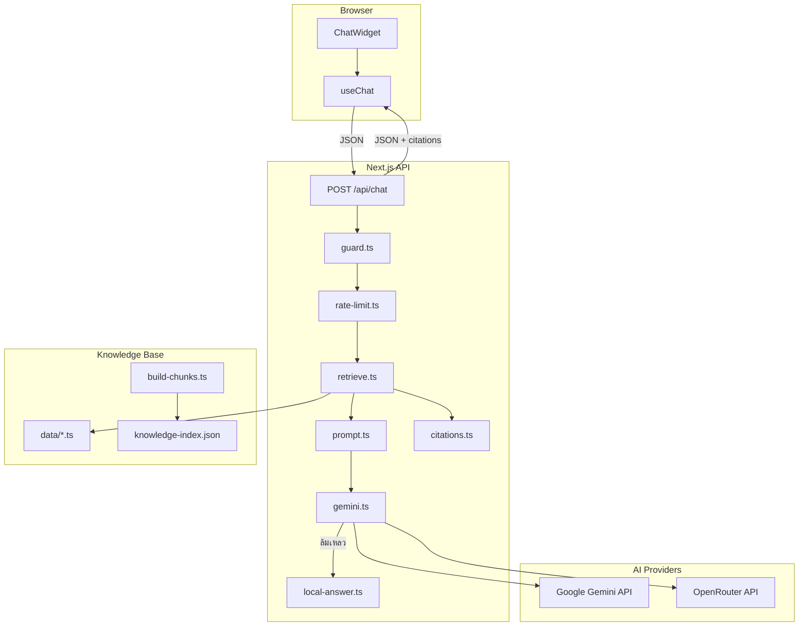

# คู่มือพัฒนา AI Chatbot แบบ RAG — Anatomy of Vapes

**ชื่อฟีเจอร์:** AI ผู้ช่วยเรียนรู้ (Knowledge Assistant)  
**เวอร์ชันอ้างอิง:** v0.3.0 (RAG Chat)  
**เอกสารนี้คืออะไร:** บันทึกสถาปัตยกรรม ขั้นตอนพัฒนา และแนวทางนำไปใช้ซ้ำในโปรเจกต์ถัดไป

### อ่านคู่กับ

| เอกสาร | ใช้เมื่อ |
|--------|---------|
| [PROJECT-GUIDE.md](./PROJECT-GUIDE.md) | ภาพรวมโปรเจกต์ทั้งระบบ |
| [STUDY-GUIDE-v0.2.0.md](./STUDY-GUIDE-v0.2.0.md) | ไล่โค้ด learner flow / 3D |
| [SETUP.md](./SETUP.md) | ตั้งค่า Supabase + env |
| [`PRODUCT.md`](../PRODUCT.md) | ขอบเขตผลิตภัณฑ์ (รวม AI chat แล้ว) |

---

## สารบัญ

1. [ภาพรวมและเป้าหมาย](#1-ภาพรวมและเป้าหมาย)
2. [สถาปัตยกรรมระบบ](#2-สถาปัตยกรรมระบบ)
3. [Knowledge Base (ฐานความรู้)](#3-knowledge-base-ฐานความรู้)
4. [Retrieval Layer (RAG)](#4-retrieval-layer-rag)
5. [LLM Layer (Gemini + Fallback)](#5-llm-layer-gemini--fallback)
6. [API Route](#6-api-route)
7. [Guardrails และความปลอดภัย](#7-guardrails-และความปลอดภัย)
8. [Frontend (Chat UI)](#8-frontend-chat-ui)
9. [การเชื่อมกับแอปหลัก](#9-การเชื่อมกับแอปหลัก)
10. [Environment Variables](#10-environment-variables)
11. [คำสั่งและการทดสอบ](#11-คำสั่งและการทดสอบ)
12. [แผนการพัฒนา (5 วัน) ที่ใช้จริง](#12-แผนการพัฒนา-5-วัน-ที่ใช้จริง)
13. [นำไปใช้ในโปรเจกต์ถัดไป](#13-นำไปใช้ในโปรเจกต์ถัดไป)
14. [ปัญหาที่เจอและวิธีแก้](#14-ปัญหาที่เจอและวิธีแก้)
15. [Demo Script สำหรับประกวด](#15-demo-script-สำหรับประกวด)

---

## 1. ภาพรวมและเป้าหมาย

### ทำไมใช้ RAG ไม่ใช่ Chatbot ทั่วไป

| แนวทาง | ข้อดี | ข้อเสีย |
|--------|-------|---------|
| LLM ตอบอิสระ | ตอบได้ทุกเรื่อง | แต่งสถิติ/กฎหมายได้ — อันตรายในหัวข้อสุขภาพ |
| **RAG (Retrieval-Augmented Generation)** | ตอบจากเนื้อหาที่ตรวจแล้ว + อ้างอิงแหล่ง | ต้องเตรียม knowledge base |
| RAG + keyword only (ไม่มี LLM) | ทำงานได้แม้ไม่มี API key | คำตอบอ่านยากกว่า AI สรุป |

โปรเจกต์นี้ใช้ **RAG แบบ hybrid**: ค้นหา chunks จากฐานความรู้ → ส่ง context ให้ LLM สรุป → ถ้า LLM ล้มเหลว ใช้ local answer จาก chunks

### ขอบเขต MVP

**ทำแล้ว**

- Chat widget (FAB + drawer มือถือ)
- RAG Q&A ภาษาไทย (ส่วนประกอบ / ผลเสีย / myth / กฎหมาย / ทักษะปฏิเสธ / การใช้แอป)
- Citations (ชื่อแหล่ง + ลิงก์)
- Deep link ไป hotspot 3D (`/anatomy?hotspot=...`)
- Quick prompts
- Guardrails (นอกเรื่อง / ข้อสอบ / ซื้อ-ขาย)
- Rate limit
- Fallback 3 ชั้น: Google Gemini → OpenRouter → Local RAG

**ยังไม่ทำ (ขอบเขตนอก MVP)**

- เก็บประวัติแชทใน Supabase
- Voice input
- Vector DB แยก (Pinecone / pgvector)
- Streaming response
- Embedding retrieval

---

## 2. สถาปัตยกรรมระบบ

### Flow หลัก



### ลำดับการประมวลผล (Request Lifecycle)

```
1. ผู้ใช้พิมพ์คำถาม
2. guardChatInput()     → ปฏิเสธทันทีถ้านอกเรื่อง / ขอเฉลยข้อสอบ
3. checkRateLimit()     → จำกัด 10 คำถาม / 10 นาที
4. retrieveKnowledge()  → ดึง top 5 chunks
5. buildUserPrompt()    → รวม context + คำถาม
6. generateGeminiAnswer() → ลอง Google → OpenRouter
7. buildLocalAnswer()   → fallback ถ้า LLM ล้มเหลว
8. buildCitations()     → แปลง sourceIds → ลิงก์อ้างอิง
9. pickPrimaryHotspotId() → deep link 3D (ถ้ามี)
10. ส่ง JSON กลับ client
```

### โครงสร้างไฟล์

```
anatomy-of-vapes/
├── app/
│   ├── api/chat/route.ts          # Endpoint หลัก
│   └── layout.tsx                 # ใส่ <ChatWidget />
├── components/chat/
│   ├── ChatWidget.tsx             # FAB + drawer
│   ├── ChatMessage.tsx            # bubble + citations
│   ├── ChatInput.tsx
│   ├── ChatQuickPrompts.tsx
│   ├── ChatCitation.tsx
│   ├── ChatHotspotLink.tsx
│   └── useChat.ts                 # client hook
├── data/
│   ├── laws.ts                    # กฎหมาย 14 หัวข้อ
│   ├── faq.ts                     # FAQ 25 + quickPrompts
│   ├── glossary.ts                # สแลงเยาวชน 12 คำ
│   ├── components.ts              # ส่วนประกอบโครงสร้าง 6
│   ├── health-effects.ts          # ผลกระทบสุขภาพ 5
│   ├── refusal-skills.ts          # ทักษะปฏิเสธ 5
│   ├── app-guide.ts               # คู่มือแอป 4
│   ├── myths.ts, hotspots.ts, quiz-questions.ts, sources.ts
│   └── knowledge-index.json       # generated (101 chunks)
├── lib/
│   ├── chat/
│   │   ├── retrieve.ts            # hybrid search
│   │   ├── guard.ts
│   │   ├── prompt.ts
│   │   ├── gemini.ts              # orchestrator
│   │   ├── local-answer.ts        # RAG-only fallback
│   │   ├── citations.ts
│   │   ├── rate-limit.ts
│   │   └── providers/
│   │       ├── direct-gemini.ts   # @google/genai SDK
│   │       └── openrouter-gemini.ts
│   └── knowledge/
│       └── build-chunks.ts        # รวมทุกแหล่ง → chunks
├── scripts/
│   ├── build-knowledge-index.ts
│   ├── test-retrieve.ts
│   ├── test-chat-api.ts
│   └── doctor-gemini.ts
└── types/
    ├── chat.ts
    └── knowledge.ts
```

---

## 3. Knowledge Base (ฐานความรู้)

### แนวคิด: ทุกแหล่งข้อมูล → `KnowledgeChunk` เดียวกัน

```typescript
interface KnowledgeChunk {
  id: string;
  type: "hotspot" | "myth" | "quiz" | "law" | "faq" | "source"
       | "glossary" | "component" | "health" | "refusal" | "app";
  title: string;
  content: string;           // ข้อความสำหรับ retrieval + context
  category: KnowledgeCategory;
  hotspotId?: string;        // เชื่อม 3D
  sourceIds: string[];       // อ้างอิง data/sources.ts
  keywords: string[];        // สำหรับ keyword search
}
```

### จำนวน chunks (v2)

| type | จำนวน | ตัวอย่าง |
|------|-------|---------|
| hotspot | 5 | นิโคติน, PG/VG, ฟอร์มาลดีไฮด์ |
| component | 6 | ปากสูบ, คอยล์, แบต |
| glossary | 12 | พอต, salt nic, disposable |
| health | 5 | ปอด, สมอง, หัวใจ |
| refusal | 5 | เพื่อนชวน, ถูกล้อ |
| app | 4 | flow แอป, PDPA |
| myth | 6 | ไอน้ำ, ปลอดภัยกว่ามวน |
| quiz | 10 | คำถาม pre/post |
| law | 14 | ขายเยาวชน, นำเข้า |
| faq | 25 | คำถามยอดนิยม |
| source | 9 | WHO, กรมควบคุมโรค |
| **รวม** | **101** | |

### วิธีเพิ่มเนื้อหาใหม่

1. แก้/เพิ่มไฟล์ใน `data/` (เช่น `data/faq.ts`)
2. ถ้าเป็น type ใหม่ → อัปเดต `types/knowledge.ts` + `lib/knowledge/build-chunks.ts`
3. รัน `npm run build:knowledge`
4. ทดสอบ `npm run test:retrieve`

### Build script

`lib/knowledge/build-chunks.ts` รวมข้อมูลจากทุก `data/*.ts` เป็น array ของ chunks  
`scripts/build-knowledge-index.ts` เขียนผลลัพธ์ลง `data/knowledge-index.json`  
`prebuild` hook ใน `package.json` รัน build:knowledge อัตโนมัติก่อน deploy

---

## 4. Retrieval Layer (RAG)

### กลยุทธ์: Hybrid Keyword Search (ไม่ใช้ Vector DB)

เหมาะกับข้อมูล < 500 chunks — เร็ว ไม่ต้องพึ่ง embedding API

**สูตรคะแนน (ย่อ):**

```
score =
  keywordMatch(query, chunk.keywords) × 3
+ titleMatch(query, chunk.title)     × 2
+ contentMatch(query, chunk.content) × 1
+ categoryBoost(query)               × (0–5)
+ typeBoost(chunk.type)              × (0–3)
```

**Category boost:** ถ้าคำถามมีคำว่า "กฎหมาย/โทษ" → boost หมวดกฎหมาย  
**Type boost:** glossary / refusal / app ได้ boost เมื่อ query ตรงบริบท  
**Thai substring:** รองรับคำไทยที่ไม่มีช่องว่าง (เช่น "บุหรี่ไฟฟ้า" ใน "บุหรี่ไฟฟ้าอันตรายไหม")

**ผลลัพธ์:** `topK = 5` chunks → ส่งเป็น CONTEXT ให้ LLM

### ไฟล์หลัก

- `lib/chat/retrieve.ts` — `retrieveKnowledge()`, `formatRetrievedContext()`, `pickPrimaryHotspotId()`
- `scripts/test-retrieve.ts` — ทดสอบ 15 คำถามตัวอย่าง

### ขั้นถัดไป (optional)

- เพิ่ม embedding (`text-embedding-004`) + cosine similarity
- รวมคะแนน: `0.6 × embedding + 0.4 × keyword`

---

## 5. LLM Layer (Gemini + Fallback)

### Provider Chain (ลำดับการลอง)

```
1. Google Gemini โดยตรง (@google/genai SDK)
   ├── Interactions API (แนะนำสำหรับ key รูปแบบ AQ.)
   └── generateContent (legacy)
2. OpenRouter (proxy ไปยัง Gemini / โมเดลฟรี)
3. Local RAG answer (ไม่มี LLM)
```

### System Prompt (หลักการ)

- ตอบภาษาไทย สั้น ชัด
- **ใช้เฉพาะ CONTEXT** — ห้ามแต่งสถิติ/กฎหมาย
- ปฏิเสธนอกเรื่อง / ข้อสอบ / การซื้อขาย
- ลงท้ายด้วยแหล่งอ้างอิง

ดูเต็มใน `lib/chat/prompt.ts`

### API Key รูปแบบใหม่ (AQ.)

Google เปลี่ยนจาก `AIzaSy...` เป็น `AQ.Ab...` (Auth Key)  
ใช้ native endpoint `generativelanguage.googleapis.com` + header `x-goog-api-key`  
**ไม่รองรับ** OpenAI-compatible endpoint กับ key รูปแบบ AQ.

### OpenRouter Fallback

เมื่อ Google project ถูก block (403) หรือไม่มี credits (402):

```env
OPENROUTER_API_KEY=sk-or-v1-...
OPENROUTER_MODEL=google/gemini-3.6-flash   # optional
```

ลำดับโมเดลในโค้ด: Gemini paid → Gemma free → `openrouter/free`

### Response mode

| mode | ความหมาย |
|------|----------|
| `ai` | LLM สรุปจาก context |
| `rag` | สรุปจาก chunks โดยตรง (ไม่มี LLM) |

---

## 6. API Route

### `POST /api/chat`

**Request:**

```json
{
  "message": "บุหรี่ไฟฟ้าอันตรายไหม",
  "history": [
    { "role": "user", "content": "..." },
    { "role": "assistant", "content": "..." }
  ],
  "sessionId": "uuid-in-sessionStorage"
}
```

**Response:**

```json
{
  "answer": "คำตอบภาษาไทย...",
  "citations": [
    { "id": "who-ecig", "title": "...", "org": "WHO", "url": "..." }
  ],
  "hotspotId": "hs-nicotine",
  "category": "ผลเสีย",
  "mode": "ai",
  "chunkIds": ["chunk-faq-...", "chunk-gloss-..."]
}
```

**HTTP Status:**

| Code | กรณี |
|------|------|
| 200 | สำเร็จ (รวม guard ปฏิเสธ) |
| 429 | rate limit |
| 500 | error ภายใน (ควรหายแล้ว — มี local fallback) |

---

## 7. Guardrails และความปลอดภัย

### Input Guard (`lib/chat/guard.ts`)

| กรณี | การทำงาน |
|------|----------|
| คำถามว่าง | แจ้งให้พิมพ์ |
| ยาวเกิน 500 ตัวอักษร | ปฏิเสธ |
| ขอเฉลย pre/post test | ปฏิเสธ (กันทุจริต) |
| ซื้อ/วิธีสูบ | ปฏิเสธ |
| นอกเรื่อง (>12 ตัวอักษร, ไม่มี keyword ยาสูบ) | ปฏิเสธ |

### Rate Limit (`lib/chat/rate-limit.ts`)

- 10 คำถาม / 10 นาที / session + IP
- In-memory (reset เมื่อ restart server)

### ความปลอดภัย API Key

- เก็บใน `.env.local` เท่านั้น — **ห้าม** `NEXT_PUBLIC_*`
- เรียก LLM ฝั่ง server (`app/api/chat/route.ts`) เท่านั้น
- อย่า commit key ลง git / อย่าส่ง key ในแชท

---

## 8. Frontend (Chat UI)

### คอมโพเนนต์

| ไฟล์ | หน้าที่ |
|------|---------|
| `ChatWidget.tsx` | ปุ่มลอย + drawer, เปิด/ปิดตาม path |
| `useChat.ts` | state, เรียก API, sessionId ใน sessionStorage |
| `ChatMessage.tsx` | bubble, loading, citations, ป้าย "สรุปจากฐานความรู้" |
| `ChatQuickPrompts.tsx` | ปุ่มคำถามสำเร็จรูปจาก `data/faq.ts` |
| `ChatHotspotLink.tsx` | ลิงก์ไป `/anatomy?hotspot=...` |
| `ChatCitation.tsx` | แสดงแหล่งอ้างอิง |

### หน้าที่แสดง Chat

| Path | แสดง |
|------|------|
| `/`, `/register`, `/login`, `/anatomy`, `/result` | แสดง |
| `/pretest`, `/posttest`, `/admin/*` | ซ่อน (กันทุจริตข้อสอบ) |

### UX มือถือ

- Drawer สูง ~78vh จากด้านล่าง
- Desktop: panel มุมขวาล่าง
- Loading: "กำลังค้นหาข้อมูล..." + spinner

---

## 9. การเชื่อมกับแอปหลัก

### Deep link 3D

1. Chat ตอบพร้อม `hotspotId` (จาก chunk ที่ retrieve ได้)
2. `ChatHotspotLink` → `router.push('/anatomy?hotspot=hs-nicotine')`
3. `app/anatomy/page.tsx` อ่าน `window.location.search` ใน `useEffect` → เปิด popup hotspot

### Landing page

การ์ด "ถาม AI ผู้ช่วย" ในส่วน "เรียนรู้ยังไง" (`app/page.tsx`)

---

## 10. Environment Variables

```env
# Google Gemini (โดยตรง)
GEMINI_API_KEY=AQ.... หรือ AIzaSy....
# GEMINI_MODEL=gemini-3.6-flash

# OpenRouter (fallback)
OPENROUTER_API_KEY=sk-or-v1-...
# OPENROUTER_MODEL=google/gemini-3.6-flash
# OPENROUTER_SITE_URL=https://your-domain.vercel.app

# Optional
# CHAT_RATE_LIMIT_PER_10MIN=10
```

ดูตัวอย่างเต็มใน `.env.example`

---

## 11. คำสั่งและการทดสอบ

| คำสั่ง | หน้าที่ |
|--------|---------|
| `npm run build:knowledge` | สร้าง `knowledge-index.json` (101 chunks) |
| `npm run test:retrieve` | ทดสอบ retrieval 15 คำถาม |
| `npm run test:chat` | ทดสอบ API 4 กรณี (ต้องรัน dev server) |
| `npm run doctor:gemini` | ตรวจ Google + OpenRouter + แนวทางแก้ |
| `npm run build` | prebuild → knowledge + Next.js build |
| `npm run dev` | เปิด http://localhost:3001 |

### Acceptance Criteria

| Test | ผ่านเมื่อ |
|------|-----------|
| ถามเรื่องนิโคติน | ตอบถูก + citations + hotspot link |
| ถามกฎหมาย | ตอบจาก laws ไม่แต่งโทษ |
| ถามนอกเรื่อง | ปฏิเสธสุภาพ |
| ถามคำตอบข้อสอบ | ปฏิเสธ |
| 10 คำถามติด | rate limit ทำงาน |
| ไม่มี API key | ยังตอบได้ (mode: rag) |
| มี OpenRouter key | mode: ai |

---

## 12. แผนการพัฒนา (5 วัน) ที่ใช้จริง

| วัน | งาน | ผลลัพธ์ |
|-----|-----|---------|
| 1 | Knowledge Base | `data/laws.ts`, `faq.ts`, `build-chunks.ts`, retrieve |
| 1.5 | ขยาย KB | glossary, components, health, refusal, app → 101 chunks |
| 2 | API + RAG | `guard`, `prompt`, `route.ts`, Gemini |
| 3 | Chat UI | `ChatWidget`, `useChat`, quick prompts |
| 4 | Integration | deep link 3D, landing card, local fallback, prebuild |
| 5 | Polish + AI fix | OpenRouter, doctor script, ทดสอบ demo |

---

## 13. นำไปใช้ในโปรเจกต์ถัดไป

### Checklist โปรเจกต์ใหม่

1. **กำหนดขอบเขต** — หัวข้อที่ตอบได้ / ห้ามตอบ
2. **สร้าง `data/*.ts`** — เนื้อหาที่ตรวจแล้ว + `sources.ts`
3. **คัดลอกโครงสร้าง**
   - `types/knowledge.ts`, `types/chat.ts`
   - `lib/knowledge/build-chunks.ts` (ปรับ source imports)
   - `lib/chat/*` (ปรับ SYSTEM_PROMPT, TOPIC_KEYWORDS ใน guard)
   - `app/api/chat/route.ts`
   - `components/chat/*`
4. **ปรับ SYSTEM_PROMPT** ให้ตรงโดเมน
5. **ปรับ `guard.ts`** — `TOPIC_KEYWORDS`, `BLOCKED_PATTERNS`
6. **ปรับ `ChatWidget`** — `ENABLED_PREFIXES`, `HIDDEN_PREFIXES`
7. **ตั้ง env** + รัน `doctor:gemini`
8. **ทดสอบ** `test:retrieve` + `test:chat`

### สิ่งที่เปลี่ยนได้ง่าย

| ส่วน | เปลี่ยนเป็น |
|------|-------------|
| โดเมนความรู้ | แก้ `data/*.ts` + rebuild index |
| LLM provider | เพิ่มใน `lib/chat/providers/` |
| UI ธีม | แก้ `ChatWidget` / `ChatMessage` classes |
| ภาษา | แก้ `SYSTEM_PROMPT` + guard messages |

### สิ่งที่ควรคงไว้

- RAG ก่อน LLM (ไม่ให้ AI เดาอิสระ)
- Guardrails ฝั่ง server
- API key ฝั่ง server เท่านั้น
- Citations ทุกคำตอบ
- Fallback เมื่อ LLM ล้มเหลว

---

## 14. ปัญหาที่เจอและวิธีแก้

| # | ปัญหา | สาเหตุ | วิธีแก้ |
|---|--------|--------|---------|
| 1 | `useSearchParams` build error บน `/anatomy` | Next.js prerender | ใช้ `window.location.search` ใน `useEffect` |
| 2 | Retrieval ภาษาไทยอ่อน | tokenize ไม่จับคำไทย | `countKeywordInQuery()` substring match |
| 3 | Gemini 403 denied access | Google project ถูก block | สร้าง project ใหม่ / OpenRouter |
| 4 | Key รูปแบบ `AQ.` | Google Auth Key ใหม่ | ใช้ `@google/genai` + native endpoint |
| 5 | `gemini-2.0-flash` 404 | โมเดลถูกยกเลิก | ใช้ `gemini-3.6-flash` |
| 6 | OpenRouter 402 | ไม่มี credits | ลองโมเดลฟรี / เติม credits |
| 7 | แชทขึ้น "ระบบไม่พร้อม" | LLM throw ไม่มี fallback | `buildLocalAnswer()` เมื่อ LLM fail |
| 8 | Script import `.ts` | build ล้มเหลว | ลบ `.ts` extension ใน scripts |

---

## 15. Demo Script สำหรับประกวด

| ลำดับ | ทำอะไร | พูดอะไร |
|-------|--------|---------|
| 1 | เปิด Landing → ชี้การ์ด AI | "ผู้เรียนถามได้ตลอด ไม่ต้องรอครู" |
| 2 | กดแชท → quick prompt นิโคติน | "ระบบค้นหาจากเนื้อหาที่ตรวจแล้ว" |
| 3 | ชี้ citations | "อ้างอิง WHO / กรมควบคุมโรค" |
| 4 | กด "ดูในโมเดล 3D" | "เชื่อมกับ hotspot บนโมเดล" |
| 5 | ถาม "ขายให้เด็กผิดกฎหมายไหม" | "ตอบเรื่องกฎหมายไทยได้" |
| 6 | ถาม "เฉลยข้อ 3 pretest" | "ปฏิเสธ — กันทุจริต" |
| 7 | ถาม "สูตรไก่ทอด" | "ปฏิเสธนอกเรื่อง" |

### Pitch หนึ่งประโยค

> "ระบบใช้ RAG ค้นหาจากฐานความรู้ 101 chunks ที่ตรวจแล้ว ส่งให้ AI สรุปคำตอบภาษาไทย พร้อมอ้างอิง WHO/กรมควบคุมโรค และลิงก์ไปโมเดล 3D"

---

## ภาคผนวก: Dependencies ที่เพิ่ม

```json
{
  "@google/genai": "^2.19.0"
}
```

ไม่ใช้ vector DB / LangChain — ลด complexity สำหรับโปรเจกต์ขนาดเล็ก

---

*อัปเดตล่าสุด: สิงหาคม 2026 — Anatomy of Vapes v0.3.0 RAG Chat*
