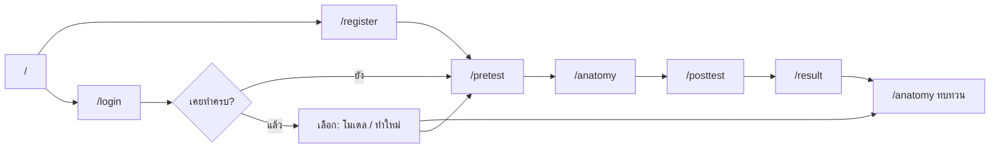
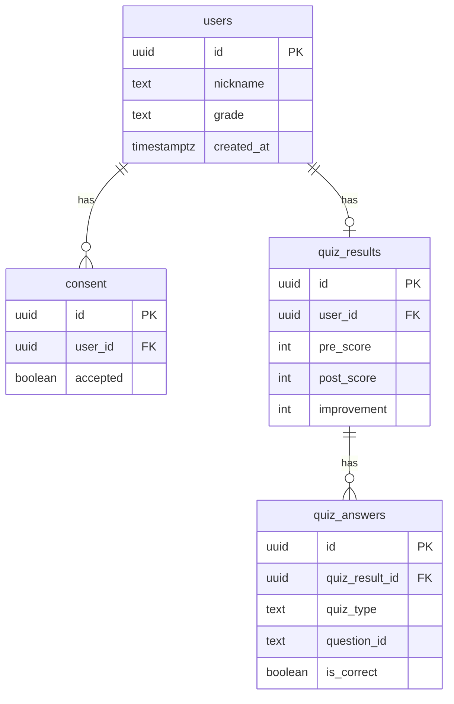

# คู่มือขั้นตอนทำเว็บทั้งระบบ — Anatomy of Vapes

**ชื่อผลิตภัณฑ์:** Anatomy of Vapes / ส่องไส้ในบุหรี่ไฟฟ้า  
**เวอร์ชันอ้างอิง:** v0.2.0 Thai Mobile Learner  
**เอกสารนี้คืออะไร:** ขั้นตอนตั้งแต่คิดผลิตภัณฑ์ → ออกแบบ UX/UI → สร้างหน้า → ฐานข้อมูล → deploy สำหรับใช้เรียนโปรเจกต์นี้

### อ่านคู่กับ

| เอกสาร | ใช้เมื่อ |
|--------|---------|
| [STUDY-GUIDE-v0.2.0.md](./STUDY-GUIDE-v0.2.0.md) | อยากไล่โค้ด / journey / บัคที่เคยเจอ |
| [SETUP.md](./SETUP.md) | ตั้ง Supabase + ทดสอบ checklist |
| [MOBILE-TUNNEL.md](./MOBILE-TUNNEL.md) | เปิดเวบบนมือถือ (LAN / Cloudflare Tunnel) |
| [CHANGELOG.md](./CHANGELOG.md) | ดูสิ่งที่เปลี่ยนในแต่ละเวอร์ชัน |
| [CHATBOT-RAG-GUIDE.md](./CHATBOT-RAG-GUIDE.md) | **AI Chatbot แบบ RAG** — สถาปัตยกรรม / นำไปใช้โปรเจกต์ถัดไป |
| [`PRODUCT.md`](../PRODUCT.md) | บริบทผลิตภัณฑ์ / ผู้ใช้ / ขอบเขต |
| [`DESIGN.md`](../DESIGN.md) | Design system (สี ฟอนต์ กติกา UI) |

---

## สารบัญ

1. [ภาพรวมโปรเจกต์](#1-ภาพรวมโปรเจกต์)
2. [สิ่งที่ต้องมีก่อนเริ่ม](#2-สิ่งที่ต้องมีก่อนเริ่ม)
3. [ขั้นที่ 1 — คิดผลิตภัณฑ์และขอบเขต](#3-ขั้นที่-1--คิดผลิตภัณฑ์และขอบเขต)
4. [ขั้นที่ 2 — ออกแบบ UX (ประสบการณ์ผู้ใช้)](#4-ขั้นที่-2--ออกแบบ-ux-ประสบการณ์ผู้ใช้)
5. [ขั้นที่ 3 — ออกแบบ UI (หน้าตาและระบบภาพ)](#5-ขั้นที่-3--ออกแบบ-ui-หน้าตาและระบบภาพ)
6. [ขั้นที่ 4 — วางสถาปัตยกรรมและสร้างโปรเจกต์](#6-ขั้นที่-4--วางสถาปัตยกรรมและสร้างโปรเจกต์)
7. [ขั้นที่ 5 — สร้างหน้าต่างทุกหน้า](#7-ขั้นที่-5--สร้างหน้าต่างทุกหน้า)
8. [ขั้นที่ 6 — State, Phase และการกันข้ามขั้น](#8-ขั้นที่-6--state-phase-และการกันข้ามขั้น)
9. [ขั้นที่ 7 — โมเดล 3D และ Hotspot](#9-ขั้นที่-7--โมเดล-3d-และ-hotspot)
10. [ขั้นที่ 8 — ฐานข้อมูล Supabase](#10-ขั้นที่-8--ฐานข้อมูล-supabase)
11. [ขั้นที่ 9 — Admin Dashboard](#11-ขั้นที่-9--admin-dashboard)
12. [ขั้นที่ 10 — ทดสอบบนมือถือ](#12-ขั้นที่-10--ทดสอบบนมือถือ)
13. [ขั้นที่ 11 — Deploy ขึ้น Vercel](#13-ขั้นที่-11--deploy-ขึ้น-vercel)
14. [แผนที่ไฟล์และ checklist เรียนจบ](#14-แผนที่ไฟล์และ-checklist-เรียนจบ)

---

## 1. ภาพรวมโปรเจกต์

เว็บแอปการศึกษาแบบ interactive โฟกัสมือถือ ให้เยาวชนไทย:

1. ยินยอม PDPA + ลงทะเบียนเบา (ชื่อเล่น + ระดับชั้น)
2. ทำแบบทดสอบก่อนเรียน (5 ข้อ)
3. สำรวจโมเดลบุหรี่ไฟฟ้า 3D + จุดสารพิษ
4. ทำแบบทดสอบหลังเรียน (5 ข้อ)
5. ดูพัฒนาการคะแนน
6. (แอดมิน) ดูสถิติและ export CSV



**หลักการผลิตภัณฑ์** (จาก `PRODUCT.md`):

1. Learn by interaction — เรียนรู้จากการสำรวจ ไม่ใช่แค่อ่าน
2. Visualize the danger — ทำให้ชิ้นส่วนและสารพิษมองเห็นได้
3. Mobile first — ใช้มือถือในห้องเรียน/กิจกรรมเป็นหลัก
4. Measure learning — มี pretest / posttest จริง
5. Consent before data — ยินยอม PDPA ก่อนเก็บข้อมูล

---

## 2. สิ่งที่ต้องมีก่อนเริ่ม

| เครื่องมือ | ใช้ทำอะไร |
|-----------|-----------|
| Node.js (LTS) + npm | รัน Next.js |
| Git + GitHub | เก็บโค้ด / เชื่อม Vercel |
| บัญชี [Supabase](https://supabase.com) | Postgres + Auth + RLS |
| บัญชี [Vercel](https://vercel.com) | Deploy production |
| เบราว์เซอร์ + มือถือจริง | ทดสอบ UX / 3D / LAN |
| (แนะนำ) VS Code / Cursor | แก้โค้ด |

โคลนและติดตั้ง:

```bash
git clone <repo-url>
cd anatomy-of-vapes
npm install
cp .env.example .env.local
npm run dev
```

เปิด `http://localhost:3001` (โปรเจกต์นี้ใช้พอร์ต **3001**)

> ถ้ายังไม่ใส่ Supabase key จริง แอปยังเล่น flow ในเครื่องได้ (local fallback) แต่ข้อมูลไม่ขึ้นแดชบอร์ด

---

## 3. ขั้นที่ 1 — คิดผลิตภัณฑ์และขอบเขต

### 3.1 ใครใช้

| บทบาท | เข้าทาง | ต้องการอะไร |
|--------|---------|-------------|
| ผู้เรียน | QR / ลิงก์มือถือ | เรียนครบเร็ว ไม่สมัครอีเมล |
| ครู / วิทยากร | ลิงก์เดียวกัน | เปิด session ในห้องเรียน |
| แอดมิน / วิจัย | `/admin/login` | สถิติ + CSV |
| นักพัฒนา | local / LAN | รัน แก้ ทดสอบ |

### 3.2 ในขอบเขต MVP (สิ่งที่โปรเจกต์นี้ทำ)

- Landing, ลงทะเบียน + PDPA, login ชื่อเล่น
- Pretest / Posttest คนละ 5 ข้อ
- Anatomy 3D (ทั้งชิ้น / แยกชิ้นส่วน) + hotspot + popup
- ผลลัพธ์เปรียบเทียบคะแนน
- ผู้เรียนที่เคยจบแล้วเลือก “ดูโมเดล” หรือ “ทำใหม่”
- Admin dashboard + CSV
- Deploy เป้า: Vercel

### 3.3 นอกขอบเขต (อย่าสมมติว่ามี)

- Leaderboard / แชร์โซเชียล
- AI chatbot
- Badge / achievement
- หลายภาษาเต็มรูปแบบ

### 3.4 หลักฐานออกแบบใน repo

- `docs/Anatomy_of_Vapes_SDD_v1.pdf` — เอกสารออกแบบผลิตภัณฑ์/เทคนิค
- `docs/wireframe.png` — wireframe learner + admin
- `docs/design-system.png` — โปสเตอร์ระบบภาพ
- `docs/logo/` + `public/images/partners.png` — โลโก้พันธมิตร

**บทเรียน:** เขียนขอบเขตให้ชัดก่อนลงมือโค้ด กัน scope creep

---

## 4. ขั้นที่ 2 — ออกแบบ UX (ประสบการณ์ผู้ใช้)

### 4.1 เป้าหมาย UX

- Session สั้น มือเดียวถือได้ ในห้องที่เสียงดัง
- ไม่บังคับอีเมล — ชื่อเล่นพอ
- ลำดับเรียนตายตัว (phase) กันข้ามขั้น
- บนมือถือแตะ hotspot ยาก → ต้องมีรายการสำรอง
- หลังจบแล้วกลับมาทบทวนโมเดลได้โดยไม่ทำลายคะแนนที่บันทึกแล้ว

### 4.2 User journey หลัก

**ครั้งแรก**

```
หน้าแรก → ลงทะเบียน+PDPA → Pretest → Anatomy (สำรวจครบ) → Posttest → ผลลัพธ์
```

**กลับมาใหม่ (เคยบันทึกผลแล้ว)**

```
เข้าสู่ระบบด้วยชื่อเล่น → เลือก “ไปดูโมเดลเลย” หรือ “ทำแบบทดสอบใหม่”
```

**ค้างกลางคัน**

```
เปิดเว็บอีกครั้ง → session ในเครื่องยังอยู่ → ปุ่ม “ดำเนินการต่อ” ตาม phase
```

### 4.3 แผนภาพหน้าจอ (Information Architecture)

```
Learner
├── /                 Landing / Hero
├── /register         ยินยอม + สมัคร
├── /login            เข้าด้วยชื่อเล่น
├── /pretest          แบบทดสอบก่อนเรียน
├── /anatomy          สำรวจ 3D (+ โหมดทบทวน)
├── /posttest         แบบทดสอบหลังเรียน
└── /result           คะแนน / ทางเลือกหลังจบ

Admin
├── /admin/login      อีเมล + รหัสผ่าน (Supabase Auth)
└── /admin            สถิติ + ตาราง + Export CSV
```

### 4.4 กติกา UX สำคัญที่ลงในโค้ด

| กติกา | ทำไม | อยู่ที่ไหน |
|-------|------|-----------|
| ต้อง pretest ก่อน anatomy | วัดความรู้ตั้งต้น | `useRequirePhase` |
| ต้องสำรวจ hotspot ครบก่อน posttest | บังคับเรียนรู้จริง | `visitedHotspots` |
| บันทึกคะแนนครั้งเดียวต่อคน | กันข้อมูลวิจัยซ้ำ | RPC + `resultSaved` |
| Review mode ไม่รีเซ็ต phase | ทบทวนได้หลังจบ | anatomy เมื่อ `currentPhase === "result"` |
| HotspotList สำรอง | มือถือแตะโมเดลยาก | `components/hotspot/HotspotList.tsx` |

### 4.5 Wireframe → UI จริง

ลำดับที่โปรเจกต์นี้ใช้:

1. วาด wireframe flow (`docs/wireframe.png`)
2. กำหนด design system (`DESIGN.md` / โปสเตอร์)
3. สร้างหน้าทีละ route ใน `app/`
4. ทดสอบบนมือถือจริง แล้ว polish

---

## 5. ขั้นที่ 3 — ออกแบบ UI (หน้าตาและระบบภาพ)

อ้างอิงเต็ม: [`DESIGN.md`](../DESIGN.md)

### 5.1 ทิศทางภาพ

- **North Star:** “Explore the Truth Inside”
- Dark-first (พื้น `#080808`) โทนอันตรายทางการศึกษา
- แดงสัญญาณ `#E53935` = อันตราย + CTA หลัก (ใช้ประหยัด)
- ฟอนต์: **Space Grotesk** (แบรนด์/หัวข้อ) + **Noto Sans Thai** (เนื้อหา)

### 5.2 Token สีหลัก

| Token | Hex | ใช้เมื่อ |
|-------|-----|---------|
| background | `#080808` | พื้นแอป |
| surface / card | `#141414` / `#1C1C1C` | แผงเนื้อหา |
| primary | `#E53935` | ปุ่มหลัก, hotspot ยังไม่สำรวจ |
| success | `#22C55E` | hotspot สำรวจแล้ว, feedback บวก |
| toxic | `#8B5CF6` | semantic สารพิษเท่านั้น ไม่ใช่ธีมม่วงทั่วไป |
| text primary/secondary | `#FFFFFF` / `#9CA3AF` | ข้อความ |

มีโหมดสว่าง (light) ด้วย — สลับผ่าน `ThemeToggle`

### 5.3 กติกา UI ที่ห้ามผิด

1. **Brand-first บน Hero** — ชื่อ Anatomy of Vapes ต้องเด่นสุดใน viewport แรก
2. **One Red Rule** — แดงไม่กระจายทุกแท็บ/ชิปพร้อมกัน
3. **No grid wallpaper** — ห้ามพื้นตารางเส้นประดับ
4. **Phone Session Rule** — ปุ่มใหญ่ แตะง่าย (~44px)
5. **Glow มีความหมาย** — แดง/เขียว = feedback ไม่ใช่ตกแต่งทั่วหน้า

### 5.4 องค์ประกอบ UI ที่ใช้ซ้ำ

| ชิ้น | ไฟล์ / ที่มา |
|------|----------------|
| ปุ่ม / input / dialog | `components/ui/*` (shadcn / Base UI) |
| Navbar + กลับ | `components/layout/AppNavbar.tsx` |
| Stepper ขั้นเรียน | `components/layout/Stepper.tsx` |
| Progress เปลี่ยนหน้า | `NavigationProgressBar` |
| Loading โมเดล | `ModelLoadingOverlay` |
| Quiz | `components/quiz/QuizEngine.tsx` |

### 5.5 ลำดับแนะนำตอนออกแบบ UI เอง

1. อ่าน `DESIGN.md` ทั้งฉบับ
2. เปิดหน้า `/` ดู Hero เป็นตัวอย่าง Persuade
3. เปิด `/pretest` หรือ `/anatomy` เป็นตัวอย่าง Operate
4. เปลี่ยนเฉพาะ token ใน CSS / Tailwind ให้ตรงระบบภาพ — อย่าคิดธีมใหม่กลางทาง

---

## 6. ขั้นที่ 4 — วางสถาปัตยกรรมและสร้างโปรเจกต์

### 6.1 Tech stack

| ชั้น | เทคโนโลยี | เหตุผลสั้น ๆ |
|------|-----------|---------------|
| Framework | Next.js 16 App Router | หน้า + routing ทันสมัย |
| UI | React 19, Tailwind 4, Base UI/shadcn | คอมโพเนนต์เร็ว + มือถือ |
| State | Zustand + persist | session ผู้เรียนในเบราว์เซอร์ |
| 3D | Three.js + R3F + Drei | โมเดล interactive |
| Form | react-hook-form + Zod | validate ลงทะเบียน |
| Backend | Supabase | DB + Auth + RLS โดยไม่เขียนเซิร์ฟเวอร์เองทั้งก้อน |
| Deploy | Vercel | เข้ากับ Next.js |

> โปรเจกต์นี้เตือนใน `AGENTS.md`: Next.js เวอร์ชันนี้มี breaking changes — อ่าน docs ใน `node_modules/next/dist/docs/` ก่อนเขียน API ใหม่

### 6.2 โครงสร้างโฟลเดอร์ (จำแผนที่นี้)

```
app/                      # หน้า (หนึ่งโฟลเดอร์ = หนึ่ง route)
components/
  auth/                   # CompletedLearnerChoice
  three/                  # ฉาก 3D
  hotspot/ quiz/ popup/   # การเรียนรู้
  layout/ theme/ ui/      # โครงและระบบ
store/useQuizStore.ts     # สมอง learner flow
lib/                      # db, phase, theme, supabase, csv
data/                     # คำถาม / hotspot / myths (เนื้อหา)
hooks/                    # phase gate, lite 3D, fullscreen
supabase/migrations/      # SQL 001 → 005
public/models/            # .glb สามชิ้น
docs/                     # คู่มือทั้งหมด
```

### 6.3 สร้างโปรเจกต์ใหม่แบบย่อ (ถ้าเริ่มจากศูนย์)

ลำดับแนวคิดที่โปรเจกต์นี้เดินมา:

1. `create-next-app` + TypeScript + Tailwind
2. ติดตั้ง UI kit / icons / motion
3. ติดตั้ง Zustand, RHF, Zod, Supabase client
4. ติดตั้ง Three / R3F / Drei
5. สร้าง `types` → `store` → หน้าเปล่าตาม IA
6. เติมเนื้อหาใน `data/`
7. เชื่อม DB
8. polish มือถือ + deploy

คำสั่งที่ใช้ประจำ:

```bash
npm run dev          # พัฒนา local พอร์ต 3001
npm run dev:mobile   # เปิดให้มือถือใน LAN เข้าได้
npm run build        # ตรวจว่า production build ผ่าน
npm run lint         # ESLint
```

---

## 7. ขั้นที่ 5 — สร้างหน้าต่างทุกหน้า

แต่ละหน้าควรมี **หน้าที่เดียว** ตาม IA

### 7.1 ตารางหน้าทั้งหมด

| Route | ไฟล์ | หน้าที่ | ใครใช้ |
|-------|------|---------|--------|
| `/` | `app/page.tsx` + `Hero.tsx` | แบรนด์, CTA, สถานะ session | ผู้เรียน |
| `/register` | `app/register/page.tsx` | ชื่อเล่น + ระดับชั้น + PDPA | ผู้เรียนใหม่ |
| `/login` | `app/login/page.tsx` | เข้าด้วยชื่อเล่นเดิม | ผู้เรียนเก่า |
| `/pretest` | `app/pretest/page.tsx` | ควิซก่อนเรียน | ผู้เรียน |
| `/anatomy` | `app/anatomy/page.tsx` | สำรวจ 3D / ทบทวน | ผู้เรียน |
| `/posttest` | `app/posttest/page.tsx` | ควิซหลังเรียน | ผู้เรียน |
| `/result` | `app/result/page.tsx` | คะแนน + บันทึก DB | ผู้เรียน |
| `/admin/login` | `app/admin/login/page.tsx` | Auth แอดมิน | แอดมิน |
| `/admin` | `app/admin/page.tsx` | สถิติ + CSV | แอดมิน |

### 7.2 รายละเอียดทีละหน้า

#### `/` หน้าแรก

- Hero เต็ม viewport: แบรนด์ + บรรทัดรอง + CTA
- ยังไม่ล็อกอิน → “เริ่มเรียนรู้” / “เข้าสู่ระบบ”
- ล็อกอินค้างขั้น → “ดำเนินการต่อ”
- จบแล้ว (`phase = result`) → “ดูโมเดลอีกครั้ง” + ดูผลลัพธ์หรือทำใหม่

#### `/register`

- Validate ด้วย Zod (`lib/validations.ts`)
- ถ้าชื่อเล่นมีอยู่แล้วและเคยทำครบ → โชว์ตัวเลือกเหมือน login
- เขียน `users` + `consent` แล้วไป pretest

#### `/login`

- ค้นหาด้วย RPC `find_learner_by_nickname`
- ถ้าเคยมีผลใน DB → `CompletedLearnerChoice` (ดูโมเดล / ทำใหม่)
- ถ้ายังไม่เคยจบ → ไป pretest

#### `/pretest` และ `/posttest`

- ใช้ `QuizEngine` ร่วมกัน
- เนื้อหาจาก `data/quiz-questions.ts`
- จบชุดแล้วเลื่อน phase และ `router.push` ขั้นถัดไป

#### `/anatomy`

- โหมดทั้งชิ้น / แยกชิ้นส่วน
- แตะ hotspot หรือเลือกจากรายการ
- ครบทุกจุดค่อยไป posttest
- ถ้า `currentPhase === "result"` = โหมดทบทวน (ไม่กระทบคะแนน)

#### `/result`

- แสดง pre / post / improvement
- `saveQuizResult` ครั้งแรกเท่านั้น
- ปุ่มดูโมเดล / เรียนอีกครั้ง / กลับหน้าหลัก
- ถ้าเข้ามาโดยไม่มีคะแนนในเครื่อง (login ซ้ำ) → โชว์ตัวเลือกแทนคะแนนว่าง

#### `/admin` + `/admin/login`

- Login ด้วย Supabase Auth (email/password)
- อ่านสถิติผ่านสิทธิ์ authenticated
- Export CSV จาก `lib/csv.ts`

### 7.3 เนื้อหาที่แก้ได้โดยไม่แตะ flow

| อยากเปลี่ยน | ไฟล์ |
|-------------|------|
| คำถามควิซ | `data/quiz-questions.ts` |
| จุดสารพิษ | `data/hotspots.ts` |
| Myth vs Fact | `data/myths.ts` |
| โมเดล 3D | `public/models/*.glb` |

---

## 8. ขั้นที่ 6 — State, Phase และการกันข้ามขั้น

### 8.1 Phase machine

ลำดับตายตัว:

```
registration → pretest → anatomy → posttest → result
```

| ไฟล์ | หน้าที่ |
|------|---------|
| `types` → `AppPhase` | ชนิด phase |
| `store/useQuizStore.ts` | เก็บ state + persist |
| `lib/phase.ts` | phase → path |
| `hooks/useRequirePhase.ts` | กันเข้าหน้าก่อนถึงขั้น |

### 8.2 สิ่งที่ persist ในเบราว์เซอร์

คีย์ localStorage: `anatomy-of-vapes-quiz`

เก็บหลัก: `userId`, `nickname`, `grade`, `consentAccepted`, คะแนน/คำตอบ, `currentPhase`, `visitedHotspots`, `resultSaved`

| Action | ความหมาย |
|--------|----------|
| `resetProgress` | ล้างความคืบหน้า เก็บตัวตน → pretest ใหม่ |
| `logout` / `resetQuiz` | ล้างทั้งหมด |

### 8.3 กติกา `useRequirePhase` (จำให้ขึ้น)

- ไม่มี nickname + consent → `/register`
- anatomy แต่ pretest ยังไม่ครบ → `/pretest`
- posttest แต่ hotspot ยังไม่ครบ → `/anatomy`
- result แต่ยังไม่ถึง phase → `/posttest`
- **ข้อยกเว้น:** phase เป็น `result` แล้วยังเข้า anatomy ได้ (ทบทวน)

**บทเรียน:** UX “ห้ามข้ามขั้น” ต้อง enforce ในโค้ด ไม่ใช่แค่ซ่อนปุ่ม

---

## 9. ขั้นที่ 7 — โมเดล 3D และ Hotspot

### 9.1 โครงคอมโพเนนต์

```
anatomy/page.tsx
  ├─ dynamic import VapeScene (ssr: false)
  ├─ โหมดทั้งชิ้น | แยกชิ้นส่วน
  ├─ HotspotList
  └─ HotspotPopup

VapeScene
  ├─ Canvas + controls + lite options
  ├─ VapeModel (mouthpiece / coilTank / battery)
  ├─ HotspotMarker
  └─ fullscreen + tutorial
```

### 9.2 ประสิทธิภาพมือถือ

| เทคนิค | ที่มา |
|--------|------|
| Lite 3D ลด DPR / ตัด shadow | `hooks/usePreferLite3D.ts` |
| `frameloop="demand"` | ไม่เรนเดอร์ตลอดเวลา |
| Hero เบา | ไม่บังคับโหลด GLB หนักบนหน้าแรก |
| Preload ที่ anatomy | โหลดเมื่อจะใช้จริง |

### 9.3 Fullscreen บนมือถือ

1. พยายาม Fullscreen API (Android / Desktop)
2. iPhone → CSS fullscreen (`position: fixed` + ล็อกสกอลล์)
3. Popup ต้อง portal เข้า fullscreen root

ไฟล์: `lib/scene-fullscreen.ts`, `hooks/useSceneFullscreen.ts`

---

## 10. ขั้นที่ 8 — ฐานข้อมูล Supabase

รายละเอียดปฏิบัติการ: [SETUP.md](./SETUP.md)

### 10.1 ทำไมเลือก Supabase

- ได้ Postgres + Auth + RLS โดยไม่ต้องสร้าง API เองทั้งก้อน
- ผู้เรียนเขียนด้วย anon key
- แอดมินอ่านด้วย authenticated session

### 10.2 ตารางหลัก



| ตาราง | เก็บอะไร |
|-------|----------|
| `users` | ชื่อเล่น + ระดับการศึกษา |
| `consent` | ยินยอม PDPA |
| `quiz_results` | คะแนน pre/post + improvement (generated) |
| `quiz_answers` | คำตอบรายข้อ |
| `admin_results` | view รวมผลให้แอดมิน |

### 10.3 Migrations ตามลำดับ (ต้องรันครบ)

| ไฟล์ | จุดประสงค์ |
|------|------------|
| `001_init.sql` | schema + RLS พื้นฐาน |
| `002_learner_login.sql` | รากฐาน login ชื่อเล่น |
| `003_one_result_per_learner.sql` | นโยบายผลครั้งเดียว |
| `004_fix_grants.sql` | GRANT กลับหลัง revoke |
| `005_learner_rpcs.sql` | RPC login + ตรวจมีผลแล้ว **สำคัญ** |

### 10.4 แนวคิดสิทธิ์ (หัวใจ)

| บทบาท | INSERT | SELECT ตรง ๆ | หมายเหตุ |
|--------|--------|---------------|----------|
| anon (ผู้เรียน) | ได้ | ไม่ได้ | ใช้ client UUID + insert โดยไม่ `.select()` |
| authenticated (แอดมิน) | — | ได้ | อ่านแดชบอร์ด |
| RPC `SECURITY DEFINER` | — | อ่านเท่าที่จำเป็น | login / ตรวจมีผลแล้ว |

**ทำไมต้อง client UUID:** RLS ให้อanon insert ได้แต่ห้าม select — ถ้า `insert().select()` จะพังแม้ข้อมูลเข้า DB แล้ว

### 10.5 ขั้นตอนตั้ง DB สั้น ๆ

1. สร้างโปรเจกต์ Supabase (แนะนำ region Singapore)
2. คัดลอก Project URL + anon key → `.env.local`
3. SQL Editor รัน `001_init.sql` แล้วตามด้วย `002`…`005` (หรืออย่างน้อย `001` + `005` ตาม SETUP)
4. Auth → สร้าง user แอดมิน (email/password)
5. ทดสอบ checklist ใน SETUP §4

ฟังก์ชันฝั่งแอปอยู่ที่ `lib/db.ts`:

- `createUser` / `saveConsent`
- `findUserByNickname`
- `hasQuizResult` / `saveQuizResult`
- `getAdminStats` (+ export)

### 10.6 ตัวแปรสภาพแวดล้อม

```env
NEXT_PUBLIC_SUPABASE_URL=https://xxxx.supabase.co
NEXT_PUBLIC_SUPABASE_ANON_KEY=eyJ...

# ไม่บังคับสำหรับผู้เรียน — ห้ามใส่ใน client
SUPABASE_SERVICE_ROLE_KEY=...
NEXT_PUBLIC_ADMIN_EMAIL=admin@example.com
NEXT_PUBLIC_GA_ID=
```

อย่า commit `.env.local` และอย่าใส่ service role ในโค้ดเบราว์เซอร์

---

## 11. ขั้นที่ 9 — Admin Dashboard

1. สร้างผู้ใช้ใน Supabase Authentication
2. เปิด `/admin/login` ใส่ email/password
3. หน้า `/admin` แสดงจำนวนผู้ใช้, ค่าเฉลี่ย pre/post, improvement
4. กด Export CSV ได้

ข้อมูลมาจาก view/ตารางที่ authenticated อ่านได้ตาม RLS — ผู้เรียนทั่วไปอ่านไม่ได้

---

## 12. ขั้นที่ 10 — ทดสอบบนมือถือ

ดูขั้นตอนละเอียดที่ **[MOBILE-TUNNEL.md](./MOBILE-TUNNEL.md)**

### 12.1 เปิดเร็ว (แนะนำ — Tunnel)

```bash
# เทอร์มินัล 1
npm run dev:mobile

# เทอร์มินัล 2
npm run tunnel
```

เปิดลิงก์ `https://….trycloudflare.com` บนมือถือ

### 12.2 LAN ใน Wi‑Fi เดียวกัน

```bash
npm run dev:mobile
```

ดู URL ในคอนโซล (เช่น `http://192.168.x.x:3001`) หรือรัน `npm run mobile:url`

ถ้าเข้าไม่ได้บน Windows: อนุญาต Node.js / พอร์ต **3001** ใน Firewall หรือใช้ tunnel

### 12.3 Checklist ทดสอบ learner

1. [ ] ลงทะเบียนใหม่ → pretest → anatomy ครบ → posttest → result บันทึกได้
2. [ ] รีเฟรชกลางคันแล้วยัง “ดำเนินการต่อ” ได้
3. [ ] Logout แล้ว login ชื่อเดิมได้
4. [ ] ถ้าเคยจบแล้ว เลือกดูโมเดลหรือทำใหม่ได้
5. [ ] Fullscreen / hotspot / HotspotList บนมือถือใช้ได้
6. [ ] ธีมมืด–สว่างไม่กระพริบผิดปกติ
7. [ ] Admin เห็นแถวและ export CSV ได้

---

## 13. ขั้นที่ 11 — Deploy ขึ้น Vercel

### 13.1 ขั้นตอน

1. Push โค้ดขึ้น GitHub
2. เข้า [vercel.com](https://vercel.com) → Import repository
3. Framework: Next.js (ตรวจจับอัตโนมัติ)
4. ใส่ Environment Variables เดียวกับ `.env.local` อย่างน้อย:
   - `NEXT_PUBLIC_SUPABASE_URL`
   - `NEXT_PUBLIC_SUPABASE_ANON_KEY`
5. Deploy
6. เปิด production URL ทดสอบ happy path อีกรอบ
7. สร้าง QR ชี้ไป production สำหรับห้องเรียน

### 13.2 หลัง deploy ควรเช็ค

| รายการ | ทำไม |
|--------|------|
| HTTPS โหลด GLB ได้ | โมเดล 3D |
| Register → Result ขึ้นใน Table Editor | env ถูก |
| Admin login บนโดเมนจริง | Auth redirect / cookie |
| มือถือ 4G / Wi‑Fi จริง | ไม่พึ่ง LAN dev |

### 13.3 สิ่งที่ไม่ได้อยู่ในโค้ดแต่ต้องทำตอนขึ้นจริง

- เนื้อหาคำถาม/hotspot ให้ทีมเนื้อหาตรวจความถูกต้อง
- นโยบายความเป็นส่วนตัว PDPA ให้หน่วยงานยืนยันข้อความ
- Firewall / DNS / โดเมนกำหนดเอง (ถ้ามี)

---

## 14. แผนที่ไฟล์และ checklist เรียนจบ

### 14.1 อยากเข้าใจเรื่อง… เปิดไฟล์นี้

| เรื่อง | ไฟล์ |
|--------|------|
| ผลิตภัณฑ์ | `PRODUCT.md` |
| Design system | `DESIGN.md` |
| Flow ผู้เรียน | `store/useQuizStore.ts`, `hooks/useRequirePhase.ts` |
| หน้าแรก / CTA | `components/Hero.tsx` |
| ตัวเลือกผู้เคยจบ | `components/auth/CompletedLearnerChoice.tsx` |
| DB | `lib/db.ts`, `supabase/migrations/*` |
| ควิซ | `components/quiz/QuizEngine.tsx`, `data/quiz-questions.ts` |
| 3D | `app/anatomy/page.tsx`, `components/three/*` |
| Fullscreen iOS | `lib/scene-fullscreen.ts` |
| ธีม | `components/theme/*`, `lib/theme.ts` |
| แอดมิน | `app/admin/page.tsx` |
| Deploy / setup | `docs/SETUP.md` |

### 14.2 ลำดับเรียนแนะนำ (2–3 วัน)

**วัน 1 — ผลิตภัณฑ์ + UX/UI**

1. อ่านเอกสารนี้ถึงขั้นที่ 5
2. อ่าน `PRODUCT.md` + `DESIGN.md`
3. เดิน happy path บนเบราว์เซอร์หนึ่งรอบ

**วัน 2 — โค้ด flow + หน้า**

1. ไล่ `useQuizStore` + `useRequirePhase`
2. อ่านทีละหน้าใน `app/`
3. แก้ข้อความใน `data/hotspots.ts` ดูผลทันที

**วัน 3 — DB + มือถือ + deploy**

1. ตั้ง Supabase ตาม SETUP
2. ทดสอบ `dev:mobile` บนเครื่องจริง
3. Deploy Vercel (หรืออย่างน้อย `npm run build` ให้ผ่าน)
4. อ่าน [STUDY-GUIDE-v0.2.0.md](./STUDY-GUIDE-v0.2.0.md) บทปัญหาที่เจอ

### 14.3 Checklist ว่า “เข้าใจโปรเจกต์นี้แล้ว”

- [ ] อธิบาย happy path ผู้เรียนได้โดยไม่ดูโน้ต
- [ ] ชี้ได้ว่า phase ถูกบังคับที่ไฟล์ไหน
- [ ] อธิบายได้ว่าทำไม anon insert โดยไม่ select
- [ ] รู้ว่าแก้คำถาม/hotspot ที่ไฟล์ไหน
- [ ] รันบนมือถือ LAN ได้
- [ ] ตั้ง env + migration ครบแล้วเห็นข้อมูลใน Table Editor
- [ ] อธิบายความต่างของโหมดทบทวนกับเรียนรอบใหม่ได้
- [ ] Deploy หรืออย่างน้อย production build ผ่าน

---

## สรุปสั้น

| ขั้น | สิ่งที่ทำ |
|------|----------|
| 1 | กำหนดผู้ใช้ ขอบเขต หลักการผลิตภัณฑ์ |
| 2 | ออกแบบ journey + IA + กติกา UX |
| 3 | ล็อก design system (สี ฟอนต์ กติกา) |
| 4 | เลือก stack สร้างโครงโฟลเดอร์ |
| 5 | สร้างหน้าทุก route ตามหน้าที่เดียว |
| 6 | Phase machine + persist + กันข้ามขั้น |
| 7 | 3D + hotspot + lite mode + fullscreen |
| 8 | Supabase schema, RLS, RPC |
| 9 | Admin auth + dashboard + CSV |
| 10 | ทดสอบมือถือจริง |
| 11 | Deploy Vercel + QR |

ถ้าจะขยายต่อ แนะนำลำดับ: ตรวจเนื้อหาใน `data/` → deploy + ทดลองห้องเรียนจริง → ค่อยเพิ่มฟีเจอร์ใหม่นอก MVP
