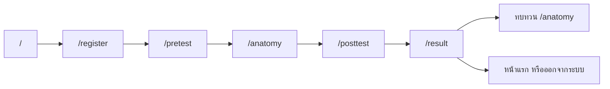
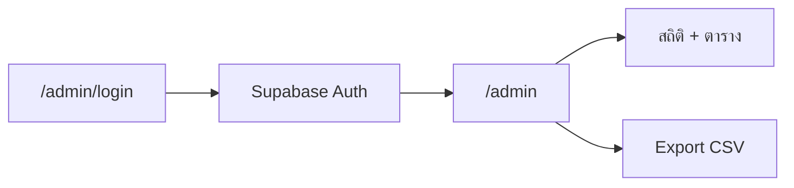

# คู่มือศึกษาโปรเจกต์ — Anatomy of Vapes / ส่องไส้ใน

**เวอร์ชัน:** v0.2.0 — Thai Mobile Learner  
**แท็ก Git:** `v0.2.0`  
**สาขาหลักของเวอร์ชันนี้:** `cursor/thai-mobile-learner-ux`  
**เอกสารคู่กัน:** [CHANGELOG.md](./CHANGELOG.md) · [SETUP.md](./SETUP.md) · [VERSION-CONTROL.md](./VERSION-CONTROL.md)

เอกสารนี้รวบรวมสิ่งที่ควรรู้เมื่อจะศึกษาหรือเขียนต่อเว็บนี้: เป้าหมาย ฟีเจอร์ สถาปัตยกรรม user journey workflow ปัญหาที่เจอและวิธีแก้

---

## 1. โปรเจกต์นี้คืออะไร

เว็บแอปการศึกษาแบบ interactive สำหรับเยาวชนไทย (มือถือเป็นหลัก) ให้

1. ทำแบบทดสอบก่อนเรียน (pretest)
2. สำรวจโมเดลบุหรี่ไฟฟ้า 3D + จุดสารพิษ (hotspot)
3. ทำแบบทดสอบหลังเรียน (posttest)
4. ดูพัฒนาการคะแนน
5. แอดมินดูสถิติและ export CSV

ชื่อผลิตภัณฑ์ในเอกสารออกแบบ: **「ส่องไส้ใน / ชำแหละบุหรี่ไฟฟ้า」**

### กลุ่มผู้ใช้

| บทบาท | เข้าทาง | เป้าหมาย |
|--------|---------|----------|
| ผู้เรียน (learner) | QR / ลิงก์มือถือ | เรียนครบ flow โดยไม่ต้องสมัครอีเมล |
| ผู้ดูแล (admin) | `/admin/login` | ดูผลรวม Export CSV |
| นักพัฒนา | local / LAN | รัน ทดสอบ แก้ UX/เนื้อหา |

---

## 2. Tech stack (v0.2.0)

| ชั้น | เทคโนโลยี | ใช้ทำอะไร |
|------|-----------|-----------|
| Framework | Next.js 16 (App Router) | หน้าและ routing |
| UI | React 19, Tailwind CSS 4, shadcn/Base UI | หน้าจอและคอมโพเนนต์ |
| State | Zustand + `persist` | session ผู้เรียนในเบราว์เซอร์ |
| 3D | Three.js, React Three Fiber, Drei | โมเดล + hotspot |
| Motion | Framer Motion | แอนิเมชันเบา ๆ |
| Form | react-hook-form + Zod | ลงทะเบียน / validate |
| Backend | Supabase (Postgres + Auth + RLS) | บันทึกผล / แอดมิน |
| Deploy เป้า | Vercel | production + QR |

> หมายเหตุใน `AGENTS.md`: Next.js เวอร์ชันนี้มี breaking changes — อ่าน docs ใน `node_modules/next/dist/docs/` ก่อนเขียนโค้ดใหม่

---

## 3. โครงสร้างโฟลเดอร์ที่ควรรู้

```
app/                    # หน้า (App Router)
  page.tsx              # หน้าแรก / Hero
  register/ login/      # สมัคร + login ชื่อเล่น
  pretest/ posttest/    # แบบทดสอบ
  anatomy/              # 3D + hotspot
  result/               # ผลคะแนน + บันทึก DB
  admin/                # แดชบอร์ด (ต้อง Auth)

components/
  three/                # VapeScene, VapeModel, Hero canvas
  hotspot/ popup/ quiz/ # จุดสำรวจ, popup, เครื่องควิซ
  layout/               # Navbar, Stepper, Footer, progress bar
  theme/ feedback/      # ธีม + loading
  dashboard/            # ตารางผลแอดมิน

store/useQuizStore.ts   # สมองของ learner flow (persist)
lib/
  db.ts                 # เขียน/อ่าน Supabase
  phase.ts              # phase → path
  scene-fullscreen.ts   # fullscreen + iOS fallback
  theme.ts supabase.ts
data/                   # เนื้อหา: คำถาม, hotspot, myth
hooks/                  # phase gate, lite 3D, fullscreen, router
supabase/migrations/    # SQL ตามลำดับ 001 → 005
public/models/          # mouthpiece.glb, coilTank.glb, battery.glb
docs/                   # SETUP, CHANGELOG, VERSION-CONTROL, คู่มือนี้
```

---

## 4. ฟีเจอร์ของเวอร์ชันนี้

### 4.1 ผู้เรียน

| ฟีเจอร์ | คำอธิบายสั้น |
|---------|----------------|
| ลงทะเบียนเบา | ชื่อเล่น + ระดับการศึกษา + ยินยอม PDPA (ไม่ใช้ email) |
| Login ชื่อเล่นเดิม | RPC `find_learner_by_nickname` |
| Session ในเครื่อง | Zustand persist — รีเฟรชแล้วยังอยู่ |
| Pretest / Posttest | ควิซทีละข้อ 5 ข้อ (เนื้อหาใน `data/quiz-questions.ts`) |
| Anatomy 3D | หมุน/ซูม, แยกชิ้นส่วน, hotspot สารพิษ |
| HotspotList สำรอง | เลือกจากรายการถ้าแตะบนโมเดลยาก (มือถือ) |
| Fullscreen สำรวจ | เต็มจอ + รายการจุด / จุดถัดไป (รองรับ iPhone แบบ CSS) |
| โหมดทบทวน | หลังจบผลลัพธ์ กลับมาดูโมเดลได้โดยไม่รีเซ็ตคะแนนที่บันทึกแล้ว |
| บันทึกคะแนนครั้งเดียว | เล่นซ้ำไม่ insert ซ้ำลง `quiz_results` |
| ธีมมืด/สว่าง | ThemeToggle + กัน hydration mismatch |
| Progress / Loading | แถบโหลดตอนเปลี่ยนหน้า + วงโหลดตอน GLB |

### 4.2 แอดมิน

| ฟีเจอร์ | คำอธิบายสั้น |
|---------|----------------|
| Login email/password | Supabase Auth |
| สถิติ | จำนวนผู้ใช้, ค่าเฉลี่ย pre/post, improvement |
| ตารางผล | view `admin_results` |
| Export CSV | `lib/csv.ts` + ปุ่มใน dashboard |

### 4.3 ประสิทธิภาพมือถือ

| ฟีเจอร์ | คำอธิบายสั้น |
|---------|----------------|
| Lite 3D | `usePreferLite3D` ลด DPR / ตัด Environment / shadows |
| Demand frameloop | ไม่เรนเดอร์ WebGL ตลอดเวลา |
| Hero เบา | เครื่องเบาไม่โหลด GLB หนักบนหน้าแรก |
| Preload anatomy | โหลดโมเดลเมื่อเข้า `/anatomy` |

---

## 5. User journey ทั้งหมดที่ควรรู้

### 5.1 ผู้เรียนครั้งแรก (happy path)



**ทีละขั้น**

1. **หน้าแรก (`/`)** — เห็นแบรนด์ Hero + CTA เริ่มเรียน / ดำเนินการต่อ (ถ้ามี session)
2. **ลงทะเบียน (`/register`)** — กรอกชื่อเล่น, ระดับชั้น, ติ๊ก PDPA  
   - เรียก `createUser` → ได้ `userId` (UUID จาก client)  
   - `saveConsent` → ตาราง `consent`  
   - ตั้ง `currentPhase = pretest`
3. **ก่อนเรียน (`/pretest`)** — ตอบ 5 ข้อ เก็บใน `preAnswers` / `preScore`
4. **สำรวจ (`/anatomy`)** — ต้องสำรวจ hotspot ครบทุกจุด (แตะบน 3D หรือจากรายการ)  
   - `visitedHotspots` ครบ → ไป posttest ได้
5. **หลังเรียน (`/posttest`)** — ตอบ 5 ข้อ → `postAnswers` / `postScore`
6. **ผลลัพธ์ (`/result`)** — แสดงคะแนน + improvement  
   - `saveQuizResult` ครั้งแรก → `quiz_results` + `quiz_answers`  
   - ตั้ง `resultSaved = true`

### 5.2 ผู้เรียนกลับมาใหม่ (มีชื่อเล่นในฐานข้อมูล)

1. ออกจากระบบ หรือเปิดเครื่องใหม่โดยไม่มี persist  
2. ไป `/login` → กรอกชื่อเล่นเดิม  
3. RPC คืน `id`, `nickname`, `grade` → เข้า session  
4. ถ้าเคยบันทึกผลแล้ว: เล่นซ้ำได้ แต่ตอน `/result` จะ **skip** การ insert (`skipped: true`)

### 5.3 ผู้เรียนค้างกลางคัน (persist ยังอยู่)

- Zustand เก็บ `currentPhase`, คะแนน, hotspot ที่สำรวจแล้ว  
- หน้าแรกแสดงปุ่มดำเนินการต่อตาม phase  
- `useRequirePhase` กันข้ามขั้น (เช่น ยังไม่ pretest แล้วจะเข้า anatomy)

### 5.4 โหมดทบทวนโมเดล

- เมื่อ `currentPhase === "result"` ยังเข้า `/anatomy` ได้  
- `useRequirePhase("anatomy")` อนุญาตพิเศษกรณีนี้  
- ไม่บังคับสำรวจใหม่เพื่อไปต่อ — ใช้ดูซ้ำ / อ่านสารพิษ

### 5.5 แอดมิน



- ผู้เรียนใช้ anon key (insert เป็นหลัก)  
- แอดมินใช้ session authenticated จึง **SELECT** ได้

### 5.6 Offline / ยังไม่ตั้ง Supabase

- `isSupabaseConfigured()` เป็น false → `createUser` ได้ `local-…` id  
- แอปยังเล่น flow ได้ในเครื่อง แต่ข้อมูลไม่ขึ้นแดชบอร์ดจริง

---

## 6. Workflow ภายในระบบ (หัวใจของโปรเจกต์)

### 6.1 Phase machine

ลำดับ phase ตายตัว:

`registration → pretest → anatomy → posttest → result`

| ไฟล์ | หน้าที่ |
|------|---------|
| `types` → `AppPhase` | ชนิด phase |
| `store/useQuizStore.ts` | เก็บ `currentPhase` |
| `lib/phase.ts` | แปลง phase → path |
| `hooks/useRequirePhase.ts` | กันเข้าหน้าก่อนถึงขั้น |

**กติกาสำคัญใน `useRequirePhase`**

- ไม่มี nickname + consent → เด้ง `/register`
- เข้า anatomy แต่ pretest ยังไม่ครบ 5 ข้อ → `/pretest`
- เข้า posttest แต่ hotspot ยังไม่ครบ → `/anatomy`
- เข้า result แต่ phase ยังไม่ถึง → `/posttest`
- exception: phase เป็น `result` แล้วยังเข้า anatomy (ทบทวน) ได้

### 6.2 State ที่ persist ในเบราว์เซอร์

คีย์ localStorage: `anatomy-of-vapes-quiz`

เก็บหลัก ๆ: `userId`, `nickname`, `grade`, `consentAccepted`, คะแนน/คำตอบ, `currentPhase`, `visitedHotspots`, `resultSaved`

ไม่ persist: คำถามทั้งชุดในหน่วยความจำชั่วคราวบางส่วน, `selectedHotspotId`

| Action | ความหมาย |
|--------|----------|
| `resetProgress` | ล้างความคืบหน้าควิซ แต่เก็บตัวตน — เริ่ม pretest ใหม่ |
| `logout` / `resetQuiz` | ล้างทั้งหมด |

### 6.3 แบบทดสอบ (QuizEngine)

1. โหลดคำถามจาก `data/quiz-questions.ts` ตามประเภท pre/post  
2. ผู้เรียนเลือกตัวเลือก → `submitAnswer`  
3. จบชุด → คำนวณคะแนน → `setPhase` ขั้นถัดไป → `router.push`

### 6.4 Anatomy / 3D workflow

```
anatomy/page.tsx
  ├─ dynamic import VapeScene (ssr: false)
  ├─ mode: ทั้งชิ้น | แยกชิ้นส่วน
  ├─ HotspotList (fallback มือถือ)
  └─ HotspotPopup (portal เข้า fullscreen root เมื่อเต็มจอ)

VapeScene
  ├─ Canvas + controls + lite options
  ├─ VapeModel (3 × GLB)
  ├─ HotspotMarker
  ├─ fullscreen (native หรือ CSS iOS)
  └─ tutorial overlay / จุดถัดไป
```

**Hotspot นับว่าสำรวจแล้วเมื่อ**

- แตะ marker บนโมเดล หรือเลือกจากรายการ → `markHotspotVisited(id)`  
- ครบทุก id ใน `data/hotspots.ts` จึงไป posttest ได้

### 6.5 Fullscreen workflow (สำคัญต่อมือถือ)

1. พยายาม `element.requestFullscreen()` (Android / Desktop)  
2. ถ้าล้มเหลวหรือ iOS → **CSS fullscreen**: `position: fixed` เต็มจอ + ล็อกสกอลล์ body  
3. Popup ต้อง render ภายในโหนดที่เป็น fullscreen root ไม่งั้นเบราว์เซอร์จะไม่แสดง

ไฟล์หลัก: `lib/scene-fullscreen.ts`, `hooks/useSceneFullscreen.ts`, `components/popup/HotspotPopup.tsx`

### 6.6 บันทึกฐานข้อมูล (เขียนแบบไม่พึ่ง SELECT)

**ปัญหาเดิม:** RLS ให้อanon **INSERT** ได้ แต่ไม่ให้ **SELECT** → ถ้าใช้ `insert().select()` จะพัง

**วิธีแก้ที่โปรเจกต์ใช้**

1. Client สร้าง `crypto.randomUUID()` เอง  
2. `insert({ id, … })` โดยไม่ขอ returning row  
3. เก็บ `id` นั้นใน Zustand เป็น `userId` / `resultId`

การ “ค้นหา” หรือ “เคยมีผลหรือยัง” ที่ต้องอ่านข้อมูล ใช้ **RPC `SECURITY DEFINER`** แทนการ SELECT ตรง ๆ

| ฟังก์ชัน | ใช้ตอน |
|----------|--------|
| `find_learner_by_nickname` | login |
| `learner_has_quiz_result` | ก่อนบันทึกผล — กันซ้ำ |

### 6.7 Theme / hydration workflow

1. Server เรนเดอร์สมมติธีมเริ่มต้นเป็น dark ให้ตรงกับ client รอบแรก  
2. Script แทรกก่อน paint (กัน FOUC) ผ่าน `useServerInsertedHTML`  
3. หลัง mount อ่าน localStorage แล้ว sync  
4. ห้ามอ่าน `document` ใน initial state ของ React โดยตรง — จะเกิด hydration mismatch

### 6.8 Navigation progress

- คลิกลิงก์ภายใน / `useAppRouter().push|replace` → แจ้ง `NavigationProgressBar`  
- ให้ผู้ใช้รู้ว่ากำลังเปลี่ยนหน้า แม้หน้า 3D โหลดช้า

---

## 7. โมเดลข้อมูล (Supabase)

### 7.1 ตารางหลัก

| ตาราง | เก็บอะไร |
|-------|----------|
| `users` | id, nickname, grade |
| `consent` | user_id, accepted |
| `quiz_results` | pre/post score, totals, improvement (generated) |
| `quiz_answers` | คำตอบรายข้อ pretest/posttest |
| `admin_results` | view รวมผลให้แอดมินอ่าน |

### 7.2 Migrations ตามลำดับ

| ไฟล์ | จุดประสงค์ |
|------|------------|
| `001_init.sql` | schema เริ่มต้น + RLS พื้นฐาน |
| `002_learner_login.sql` | รากฐาน login ชื่อเล่น |
| `003_one_result_per_learner.sql` | นโยบายผลครั้งเดียว |
| `004_fix_grants.sql` | GRANT กลับหลัง revoke (กัน permission denied) |
| `005_learner_rpcs.sql` | RPC login + ตรวจมีผลแล้ว (แนะนำรันใน SQL Editor) |

รายละเอียด setup: [SETUP.md](./SETUP.md)

### 7.3 สิทธิ์แบบย่อ

| บทบาท | INSERT ผู้เรียน | SELECT ผล | Auth |
|--------|-----------------|-----------|------|
| anon (ผู้เรียน) | ได้ | ไม่ตรง ๆ (ใช้ RPC เมื่อจำเป็น) | ไม่ใช้ |
| authenticated (แอดมิน) | — | ได้ผ่าน view/ตารางตาม RLS | email/password |

---

## 8. ปัญหาที่เจอ และวิธีแก้ (สำหรับศึกษา)

จัดกลุ่มตามบทเรียนที่มักเจอตอนทำเว็บมือถือ + 3D + BaaS

### 8.1 Layout / 3D บนจอเล็ก

| ปัญหา | สาเหตุ | วิธีแก้ |
|-------|--------|---------|
| Canvas ไม่เต็มกล่อง | ความสูงจาก flex/`min-height` อย่างเดียว Canvas ไม่รู้ความสูงจริง | กำหนดความสูงชัด (`dvh`) + Canvas `absolute inset-0` |
| แตะ hotspot ยาก | จุดเล็กบนโมเดล | `HotspotList` สำรอง + ขยาย touch target |
| กระตุก | WebGL หนักบนมือถือ | lite mode, ลด DPR, ตัด shadows/environment, `frameloop="demand"` |

**บทเรียน:** บนมือถืออย่าพึ่ง “ความสูงจากเนื้อหาอย่างเดียว” สำหรับ WebGL — ต้องมีกล่องสูงชัด

### 8.2 Fullscreen

| ปัญหา | สาเหตุ | วิธีแก้ |
|-------|--------|---------|
| Popup หายตอนเต็มจอ | Fullscreen API แสดงได้แค่ลูกหลานของ element ที่ขอ fullscreen | Portal popup เข้า fullscreen root |
| iPhone กดแล้วเงียบ | iOS ไม่รองรับ `requestFullscreen` บน `<div>` ทั่วไป | CSS fullscreen fallback + ล็อกสกอลล์ |

**บทเรียน:** ฟีเจอร์เบราว์เซอร์ไม่เท่ากันทุกแพลตฟอร์ม — ต้องมี fallback และทดสอบบนเครื่องจริง

### 8.3 โหลด / LAN / Dev

| ปัญหา | สาเหตุ | วิธีแก้ |
|-------|--------|---------|
| หน้าแรกค้างบนมือถือ | โหลด GLB รวมใหญ่ตั้งแต่ Hero | แยกภาระ: หน้าแรกเบา, preload ที่ anatomy |
| เปิดจาก IP LAN ไม่ขึ้น | Next.js บล็อก origin ของ `/_next` | `allowedDevOrigins` ใน `next.config.ts` |
| PC ตอบ 200 แต่มือถือเข้าไม่ได้ | Windows Firewall | อนุญาต Node.js / พอร์ต หรือใช้ tunnel |
| ไม่รู้ว่าหน้ากำลังโหลด | ไม่มี feedback | Progress bar + model loading overlay |

**คำสั่งที่ใช้ศึกษา**

```bash
npm run dev:mobile   # bind 0.0.0.0 + พิมพ์ URL LAN
npm run mobile:url   # ดู IP/URL อย่างเดียว
```

### 8.4 React hydration / script

| ปัญหา | สาเหตุ | วิธีแก้ |
|-------|--------|---------|
| Theme hydration mismatch | SSR กับ client คนละค่าตอน first paint | initial state ตรงกัน แล้ว sync หลัง mount |
| คำเตือน script ใน layout | ใส่ `<script>` ในต้นไม้ React ผิดที่ | `useServerInsertedHTML` / `next/script` |

**บทเรียน:** อะไรที่อ่านจาก `window`/`localStorage` ห้ามใส่ใน initial render ที่ต้อง match กับ HTML จาก server

### 8.5 Supabase / RLS

| ปัญหา | สาเหตุ | วิธีแก้ |
|-------|--------|---------|
| Insert สำเร็จแต่แอป error | โค้ดรอ `select` แถวกลับ แต่ anon ไม่มี SELECT | Client UUID + insert อย่างเดียว |
| `permission denied` | revoke จาก public แล้วลืม grant กลับ | `004_fix_grants.sql` |
| Login ชื่อเล่นไม่ได้ | RLS กันอ่านตาราง users | RPC `SECURITY DEFINER` |
| คะแนนซ้ำตอนเล่นซ้ำ | ไม่มีกติกา one-result | RPC ตรวจ + skip insert |

**บทเรียน:** ออกแบบสิทธิ์ก่อน แล้วค่อยออกแบบ API ของแอปให้เข้ากับสิทธิ์ — อย่าสมมติว่า insert แล้วอ่านแถวตัวเองได้เสมอ

### 8.6 UI / เนื้อหา

| ปัญหา | สาเหตุ | วิธีแก้ |
|-------|--------|---------|
| Checkbox กลืนพื้น | contrast ต่ำ | ขอบสีตัดกับพื้นมืด |
| Hero/hierarchy อ่านยาก | spacing / AI slop | polish ตาม Impeccable |
| Grid background รก | anti-pattern | ลบ utility grid |

### 8.7 คงเหลือที่ยังไม่ปิดในโค้ดแอป

- คำเตือน `THREE.Clock` deprecated จาก library — รออัปเดต R3F/three  
- เนื้อหาคำถาม/hotspot อาจยังเป็น placeholder ให้แทนทีหลังใน `data/`  
- Production deploy / QR จริงอยู่ที่ขั้นตอน Vercel นอก repo

รายการสั้นในตารางเดียว: [CHANGELOG.md](./CHANGELOG.md)

---

## 9. แผนที่ไฟล์ตามงาน (เปิดอ่านตอนศึกษา)

| อยากเข้าใจเรื่อง… | เปิดไฟล์เหล่านี้ก่อน |
|-------------------|----------------------|
| Flow ผู้เรียนทั้งก้อน | `store/useQuizStore.ts`, `hooks/useRequirePhase.ts` |
| บันทึก DB | `lib/db.ts`, `supabase/migrations/005_learner_rpcs.sql` |
| ควิซ | `components/quiz/QuizEngine.tsx`, `data/quiz-questions.ts` |
| 3D + hotspot | `app/anatomy/page.tsx`, `components/three/VapeScene.tsx`, `VapeModel.tsx`, `data/hotspots.ts` |
| Fullscreen iOS | `lib/scene-fullscreen.ts`, `hooks/useSceneFullscreen.ts` |
| ธีม | `components/theme/*`, `lib/theme.ts`, `app/layout.tsx` |
| หน้าแรก / Hero | `components/Hero.tsx`, `components/three/HeroVapeCanvas.tsx` |
| แอดมิน | `app/admin/page.tsx`, `lib/db.ts` → `getAdminStats` |
| มือถือ LAN | `next.config.ts`, `scripts/print-mobile-url.mjs`, `docs/SETUP.md` §5.1 |

---

## 10. User journey × ไฟล์ที่เกี่ยวข้อง (cheat sheet)

| จุดใน journey | Route | เขียน state | แตะ DB |
|---------------|-------|-------------|--------|
| ลงทะเบียน | `/register` | user + consent + phase pretest | `users`, `consent` |
| Login เดิม | `/login` | โหลด user จาก RPC | RPC เท่านั้น |
| Pretest | `/pretest` | preAnswers, preScore | — |
| Anatomy | `/anatomy` | visitedHotspots | — |
| Posttest | `/posttest` | postAnswers, postScore | — |
| Result | `/result` | resultSaved | `quiz_results`, `quiz_answers` |
| ทบทวน | `/anatomy` | phase ยังเป็น result | — |
| Admin | `/admin` | — | SELECT ผ่าน Auth |

---

## 11. ลำดับแนะนำสำหรับศึกษาโค้ด (1–2 วัน)

1. อ่านคู่มือนี้ทั้งฉบับ + รัน `npm run dev` เดิน happy path เองหนึ่งรอบ  
2. (ถ้ายังใหม่กับ Git) อ่าน [VERSION-CONTROL.md](./VERSION-CONTROL.md) แล้วทำแบบฝึกหัดสั้นท้ายเอกสาร  
3. ไล่ `useQuizStore` + `useRequirePhase` ให้เข้าใจว่าทำไมบางหน้าเด้ง  
4. อ่าน `lib/db.ts` คู่กับ migrations — จุดสำคัญคือ client UUID และ RPC  
5. เปิด `/anatomy` บนมือถือจริง (`dev:mobile`) — ลอง fullscreen + hotspot  
6. สร้างสาขา `study/…` แล้วลองเปลี่ยนข้อความใน `data/hotspots.ts` / `quiz-questions.ts`  
7. อ่าน CHANGELOG แล้วจับคู่แต่ละบัคกับไฟล์ที่แก้ (`git log` ตามคู่มือ VC)  
8. (ขั้นสูง) ลองทำแอดมิน user ใหม่ใน Supabase แล้ว Export CSV

---

## 12. คำศัพท์ในโปรเจกต์

| คำ | ความหมายในโปรเจกต์นี้ |
|----|------------------------|
| Phase | ขั้นของ learner flow |
| Hotspot | จุดสารพิษบนโมเดล 3D |
| Exploded view | แยกชิ้นปาก / แท็งก์ / แบต |
| Lite 3D | โหมดเบาสำหรับเครื่องช้า |
| Persist | เก็บ state ใน localStorage |
| RPC | ฟังก์ชัน SQL ที่เรียกผ่าน Supabase client |
| RLS | Row Level Security ของ Postgres/Supabase |
| Review mode | ดู anatomy หลังมีผลลัพธ์แล้ว |

---

## 13. สรุปสั้นสำหรับจำ

- **ผลิตภัณฑ์:** เว็บเรียน 3D มือถือไทย วัดความรู้ก่อน–หลัง  
- **สมองฝั่ง client:** Zustand phase machine + persist  
- **สมองฝั่ง server:** Supabase insert-heavy + RPC สำหรับอ่านเท่าที่จำเป็น  
- **จุดยากที่โปรเจกต์นี้สอนจริง:** iOS fullscreen, LAN/dev origins, RLS กับ insert โดยไม่ select, WebGL บนมือถือ  
- **เวอร์ชันนี้ชื่อ:** **v0.2.0 Thai Mobile Learner**

ถ้าจะขยายเวอร์ชันถัดไป แนะนำเริ่มจาก: แทนเนื้อหาจริงใน `data/` → deploy Vercel + QR → ทดสอบห้องเรียนจริง → ค่อยเพิ่มฟีเจอร์ใหม่
