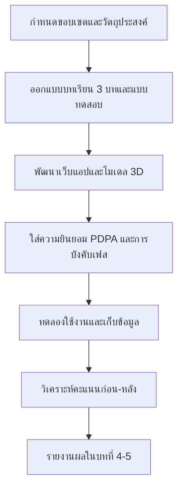

# บทที่ 3 วิธีดำเนินการ

> บทนี้อธิบายแบบแผนการวิจัย กลุ่มตัวอย่าง เครื่องมือ ลำดับการใช้งาน  
> การออกแบบเนื้อหา 3 บท แบบทดสอบ การเก็บข้อมูล การวิเคราะห์ และจริยธรรม  
> อ้างอิงจากระบบจริงของ Anatomy of Vapes

---

## 3.1 แบบแผนการวิจัย

โครงงานนี้ใช้แบบแผน **การวิจัยเชิงพัฒนาและประเมินผล (Development and Evaluation Research)** แบ่งเป็น 2 ส่วนหลัก

1. **ส่วนพัฒนา**  
   พัฒนาเว็บแอปการศึกษาแบบ interactive ที่ประกอบด้วยโมเดล 3D จุดสำรวจสารพิษ บทเรียน 3 บท แบบทดสอบก่อน–หลัง และผู้ช่วยความรู้
2. **ส่วนประเมินผล**  
   วัดความรู้ของผู้เรียนด้วยคะแนนแบบทดสอบก่อนเรียนและหลังเรียน แล้วเปรียบเทียบการเปลี่ยนแปลง

ไม่ใช่การทดลองทางคลินิก และไม่ได้มุ่งวินิจฉัยหรือรักษาผู้ติดนิโคติน

---

## 3.2 ประชากรและกลุ่มตัวอย่าง

### 3.2.1 ประชากรเป้าหมาย

เยาวชนไทยในระดับมัธยมต้นถึงมหาวิทยาลัยหรืออาชีวศึกษา ที่เข้าร่วมกิจกรรมเรียนรู้หรือเปิดลิงก์/QR ของแอปด้วยตนเอง

### 3.2.2 กลุ่มตัวอย่างในระบบ

กลุ่มตัวอย่างเชิงปฏิบัติคือผู้เรียนที่

1. เข้าหน้าลงทะเบียน (`/register`)
2. ยินยอมตาม PDPA
3. กรอกข้อมูลที่จำเป็น เช่น ชื่อเล่นและระดับชั้น
4. ทำแบบทดสอบก่อนเรียน สำรวจโมเดล และทำแบบทดสอบหลังเรียนจนบันทึกผล

ผู้ที่เข้าสู่ระบบซ้ำ (`/login`) อาจเลือกทำแบบทดสอบใหม่หรือเข้าโหมดทบทวนโมเดล โดยโหมดทบทวนไม่เขียนทับคะแนนที่บันทึกแล้ว

### 3.2.3 เกณฑ์คัดเข้าและคัดออก

| คัดเข้า | คัดออก / ไม่นับเป็นผลครบวงจร |
|---------|--------------------------------|
| ยินยอม PDPA | ไม่ยินยอมหรือออกกลางคันก่อนบันทึกผล |
| ใช้งานผ่านเบราว์เซอร์ที่รองรับ | ข้อมูลไม่ครบตามเฟสที่ระบบบังคับ |
| ทำครบ pretest → anatomy → posttest | เข้าโหมดทบทวนอย่างเดียวโดยไม่ทำแบบทดสอบใหม่ |

หมายเหตุ: ขนาดตัวอย่างสุดท้ายขึ้นกับจำนวนผู้ใช้งานจริงในช่วงเก็บข้อมูล ซึ่งจะรายงานในบทผลการวิจัย (บทที่ 4) เมื่อมีข้อมูลจากฐานข้อมูล

---

## 3.3 เครื่องมือที่ใช้ในโครงงาน

### 3.3.1 เว็บแอป Anatomy of Vapes

เทคโนโลยีหลัก: Next.js, React, Tailwind CSS, Zustand, Three.js / React Three Fiber, Supabase, Vercel

เส้นทางการเรียนรู้ของผู้เรียน

```text
/  (หน้าแรก)
→ /register หรือ /login
→ /pretest          แบบทดสอบก่อนเรียน 5 ข้อ
→ /anatomy          สำรวจโมเดล 3D + จุดสารพิษ
→ /posttest         แบบทดสอบหลังเรียน 5 ข้อ
→ /result           เปรียบเทียบคะแนนและทบทวนได้
```

แอดมินเข้าผ่าน `/admin/login` เพื่อดูสถิติรวมและส่งออก CSV

### 3.3.2 โมเดล 3D และจุดสำรวจ

ผู้เรียนหมุนโมเดล เปิดโหมดแยกชิ้นส่วน และแตะจุดสารพิษ ระบบบังคับให้สำรวจครบทุกจุดก่อนไปแบบทดสอบหลังเรียน (ยกเว้นโหมดทบทวน)

### 3.3.3 บทเรียน 3 บท

เนื้อหาละเอียดเก็บใน `data/chapters.ts` และเชื่อมกับ hotspot, ความเชื่อผิด, แหล่งอ้างอิง และรหัสคำถาม

### 3.3.4 ผู้ช่วยความรู้ (RAG)

คลังความรู้ถูกสร้างจากไฟล์ใน `data/` รวมถึงบทเรียน ผ่านคำสั่งสร้างดัชนีความรู้ ผู้ช่วยดึงเนื้อหาที่เกี่ยวข้องก่อนตอบ และมีกฎไม่เฉลยคำตอบแบบทดสอบโดยตรง

---

## 3.4 การออกแบบเนื้อหา 3 บท

### 3.4.1 แผนที่บทเรียน ↔ จุดสำรวจ ↔ คำถาม

| บท | หัวข้อ | Hotspot | คำถามก่อนเรียน | คำถามหลังเรียน |
|----|--------|---------|----------------|----------------|
| 1 | นิโคตินและสมองวัยรุ่น | `hs-nicotine` | pre-1, pre-2 | post-1, post-2 |
| 2 | น้ำยา คอยล์ และสารพิษ | `hs-pg-vg`, `hs-formaldehyde`, `hs-acrolein` | pre-3, pre-4 | post-3, post-4 |
| 3 | แบตเตอรี่ โลหะ และความปลอดภัย | `hs-lithium` | pre-5 | post-5 |

### 3.4.2 องค์ประกอบของแต่ละบท

แต่ละบทมี

- ชื่อบทและคำโปรย
- ย่อหน้าเปิดบท
- หัวข้อย่อยพร้อมคำอธิบายและจุดสำคัญ
- สรุปสั้น 3–5 ข้อ
- ลิงก์ไปยัง myth, hotspot, แหล่งอ้างอิง และรหัสคำถาม

### 3.4.3 การแสดงผลในแอป

บนป๊อปอัปจุดสำรวจ ผู้เรียนเห็นป้าย “บทที่ X” และสามารถเปิดอ่านบทเรียนเต็มแบบย่อได้โดยไม่ต้องออกจากหน้า anatomy

---

## 3.5 แบบทดสอบก่อนเรียนและหลังเรียน

### 3.5.1 โครงสร้างข้อสอบ

| รายการ | รายละเอียด |
|--------|------------|
| จำนวนข้อก่อนเรียน | 5 ข้อ เลือกตอบ 4 ตัวเลือก |
| จำนวนข้อหลังเรียน | 5 ข้อ เลือกตอบ 4 ตัวเลือก |
| คะแนนเต็มแต่ละรอบ | 5 คะแนน (ข้อละ 1 คะแนน) |
| การกระจายตามบท | บท 1 = 2 ข้อ, บท 2 = 2 ข้อ, บท 3 = 1 ข้อ |

### 3.5.2 ตัวอย่างประเด็นที่วัด

- บทที่ 1: สิ่งที่พ่นออกมาคือละอองฝอย ไม่ใช่ไอน้ำ; นิโคตินกระทบสมองวัยรุ่น
- บทที่ 2: หน้าที่คอยล์; สารจากความร้อน; กลิ่นผลไม้ไม่เท่ากับความปลอดภัย
- บทที่ 3: ความเสี่ยงแบตเตอรี่และโลหะหนัก

แต่ละข้อมีคำอธิบาย (explanation) สำหรับใช้ในคลังความรู้ แต่ระบบแชทถูกออกแบบไม่ให้เฉลยคำตอบแบบทดสอบโดยตรงระหว่างที่ผู้เรียนยังอยู่ในช่วงทำข้อสอบ

### 3.5.3 เกณฑ์การแปลผลเบื้องต้น

| ระดับ | คะแนน (จาก 5) | ความหมายเชิงปฏิบัติ |
|-------|----------------|---------------------|
| ควรทบทวน | 0–2 | ควรกลับไปสำรวจจุดสารพิษและอ่านบทเรียนอีกครั้ง |
| พอใช้ | 3 | เข้าใจบางส่วน ยังมีช่องว่าง |
| ดี | 4–5 | เข้าใจประเด็นหลักของทั้ง 3 บทได้ดี |

การเปรียบเทียบหลักของโครงงานคือ **ผลต่างคะแนนหลังเรียน − ก่อนเรียน** และร้อยละการปรับปรุง ซึ่งแสดงในหน้า `/result`

---

## 3.6 การเก็บรวบรวมข้อมูล

### 3.6.1 ลำดับการเก็บข้อมูล

1. ผู้เรียนยินยอม PDPA และลงทะเบียน
2. ระบบบันทึกคำตอบแบบทดสอบก่อนเรียนทีละข้อ/ทั้งชุดตามการออกแบบฐานข้อมูล
3. ระบบบันทึกว่าผู้เรียนเปิดจุดสำรวจใดบ้าง
4. บันทึกคำตอบแบบทดสอบหลังเรียน
5. คำนวณและแสดงผลเปรียบเทียบคะแนน
6. แอดมินดูสถิติรวมหรือส่งออก CSV ได้ตามสิทธิ์

### 3.6.2 ข้อมูลที่เก็บ (ภาพรวม)

| ประเภทข้อมูล | ตัวอย่าง | วัตถุประสงค์ |
|--------------|----------|--------------|
| โปรไฟล์ผู้เรียนแบบย่อ | ชื่อเล่น, ระดับชั้น | จัดกลุ่มและแสดงผลส่วนบุคคล |
| ความยินยอม | สถานะยินยอม PDPA | ปฏิบัติตามกฎหมายคุ้มครองข้อมูล |
| คำตอบแบบทดสอบ | รหัสข้อ, ตัวเลือกที่เลือก | วิเคราะห์ความรู้ก่อน–หลัง |
| ความคืบหน้า anatomy | จุด hotspot ที่เปิดแล้ว | บังคับลำดับการเรียนรู้ |
| สถิติรวม | จำนวนผู้เรียน, คะแนนเฉลี่ย | แดชบอร์ดแอดมิน |

ระบบตั้งใจไม่เก็บข้อมูลส่วนบุคคลเกินจำเป็นสำหรับบริบทการศึกษาและสร้างเสริมสุขภาพ

### 3.6.3 เครื่องมือฐานข้อมูล

ใช้ Supabase เป็นที่เก็บข้อมูลผู้ใช้ ความยินยอม ผลแบบทดสอบ และคำตอบรายข้อ การบังคับลำดับเฟสทำในฝั่งแอป เพื่อไม่ให้ข้ามขั้นโดยไม่ได้ตั้งใจ

---

## 3.7 การวิเคราะห์ข้อมูล

### 3.7.1 ระดับบุคคล

หน้าผลลัพธ์แสดง

- คะแนนก่อนเรียน
- คะแนนหลังเรียน
- ผลต่างและทิศทางปรับปรุง
- ทางเลือกกลับไปทบทวนโมเดลหรือเริ่มทำแบบทดสอบใหม่

### 3.7.2 ระดับภาพรวม (แอดมิน)

แดชบอร์ดสรุปสถิติการมีส่วนร่วมและผลการเรียนรู้แบบรวม และรองรับการส่งออก CSV สำหรับวิเคราะห์เพิ่มนอกระบบ เช่น

- จำนวนผู้เรียนที่ลงทะเบียนและทำครบวงจร
- คะแนนเฉลี่ยก่อน–หลัง
- สัดส่วนผู้ที่มีคะแนนดีขึ้น

### 3.7.3 สถิติที่วางแผนใช้ในบทผลการวิจัย

เมื่อมีข้อมูลจริง จะรายงานอย่างน้อยดังนี้

1. จำนวนและร้อยละผู้เรียนที่ทำครบทุกขั้น
2. ค่าเฉลี่ยและส่วนเบี่ยงเบนมาตรฐานของคะแนนก่อน–หลัง (ถ้าขนาดตัวอย่างเพียงพอ)
3. ร้อยละของผู้ที่มีคะแนนหลังเรียนสูงกว่าก่อนเรียน
4. การวิเคราะห์รายข้อหรือรายบท (ถ้าข้อมูลรองรับ)

---

## 3.8 จริยธรรมและการคุ้มครองข้อมูล

1. **ความยินยอมก่อนเก็บข้อมูล** — ผู้เรียนต้องยอมรับ PDPA ก่อนเริ่มเส้นทางการเรียนรู้ที่บันทึกข้อมูล  
2. **เก็บเท่าที่จำเป็น** — ใช้ชื่อเล่นและระดับชั้น ไม่บังคับข้อมูลอ่อนไหวเกินขอบเขตการศึกษา  
3. **ไม่เฉลยข้อสอบในแชท** — ผู้ช่วยความรู้ถูกจำกัดไม่ให้เฉลยคำตอบแบบทดสอบโดยตรง เพื่อรักษาความน่าเชื่อถือของการวัดผล  
4. **โหมดทบทวนไม่ทำลายคะแนน** — หลังบันทึกผลแล้ว ผู้เรียนกลับมาดูโมเดลได้โดยไม่รีเซ็ตผลโดยไม่ตั้งใจ  
5. **ข้อความสุขภาพ** — เนื้อหาเป็นการให้ความรู้ทั่วไป อ้างอิงหน่วยงานสาธารณสุข ไม่ใช่คำแนะนำรักษาเฉพาะราย  
6. **การตรวจทานพันธมิตร** — ข้อความสำคัญควรได้รับการยืนยันจากหน่วยงานพันธมิตรก่อนใช้ในแคมเปญทางการ

---

## 3.9 สรุปขั้นตอนดำเนินการทั้งโครงงาน



บทที่ 1–3 ของรายงานฉบับนี้ครอบคลุมถึงขั้นออกแบบและวิธีดำเนินการ ส่วนผลการใช้งานจริงจะนำเสนอในบทที่ 4 และสรุปข้อเสนอแนะในบทที่ 5 เมื่อมีข้อมูลจากผู้เรียนเพียงพอ

---

## เอกสารและไฟล์อ้างอิงในระบบ

| ไฟล์ | บทบาทในวิธีดำเนินการ |
|------|----------------------|
| `PRODUCT.md` | บริบทผู้ใช้ ขอบเขต และหลักการผลิตภัณฑ์ |
| `data/chapters.ts` | เนื้อหาบทเรียน 3 บท |
| `data/hotspots.ts` | จุดสำรวจบนโมเดล |
| `data/quiz-questions.ts` | คำถามก่อน–หลังเรียน |
| `data/myths.ts` | ความเข้าใจผิดและข้อเท็จจริง |
| `data/laws.ts` | เนื้อหากฎหมายสำหรับความรู้และ RAG |
| `data/sources.ts` | แหล่งอ้างอิงสาธารณสุข |
| `docs/PROJECT-GUIDE.md` | คู่มือขั้นตอนระบบทั้งชุด |
| `docs/Anatomy_of_Vapes_SDD_v1.pdf` | เอกสารออกแบบระบบต้นทาง |
| `lib/chat/guard.ts` | กฎไม่เฉลยแบบทดสอบในแชท |
